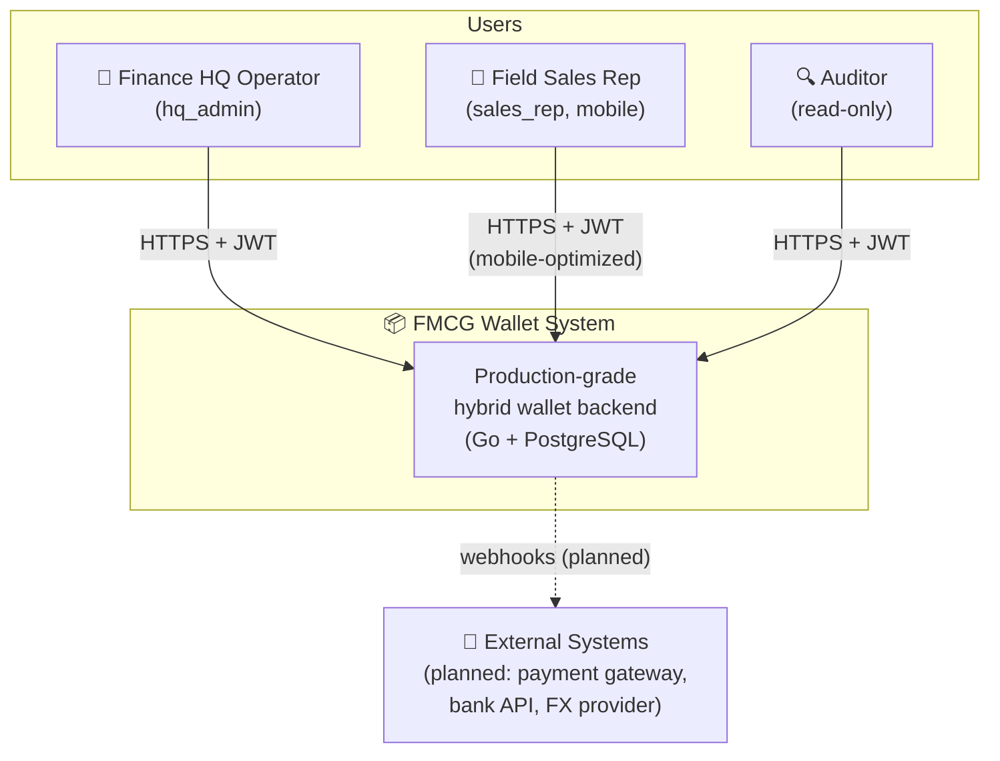
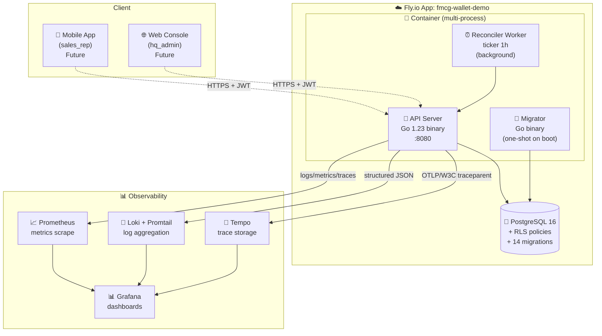
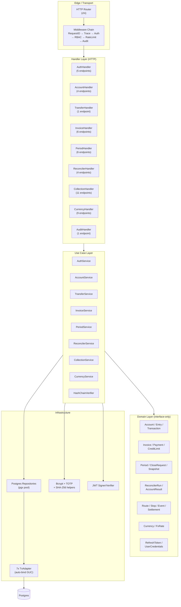
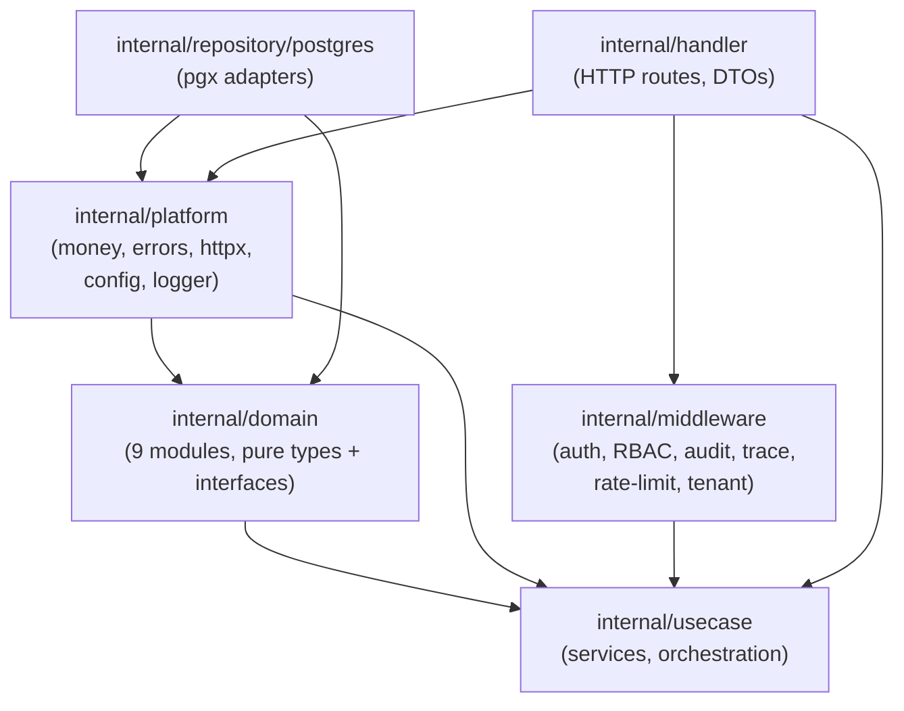

# C4 Architecture Diagrams

This page presents the system architecture using the [C4 model](https://c4model.com/) (Context, Container, Component, Code). See [Architecture Overview](overview.md) for the high-level narrative.

---

## Level 1 — System Context

Who uses the system and how does it fit into the wider world.

**Key points:**
- Single bounded context: FMCG Wallet serves one Indonesian FMCG distributor's finance operations
- Three actor types: HQ (full access), field (scoped to own routes), auditor (read-only)
- External integrations (payment gateway, FX provider) are planned but not yet implemented (deferred to post-MVP)

---

## Level 2 — Container Diagram

The deployable units inside FMCG Wallet.

**Key points:**
- **Single container, multi-process** via `supervisord` (postgres + migrator + api + worker)
- API + worker share codebase (worker is built from `cmd/worker/`)
- DB is local to the container in demo (production would use managed Postgres)
- Observability stack is provisioned via `docker-compose.yml` (TIG stack)

---

## Level 3 — Component Diagram

What's inside the API binary.

**Key points:**
- **Clean-lite architecture**: domain layer has zero infrastructure imports
- 9 cohesive modules, each with: domain types + repository interface + service + handler
- Handlers do thin DTO mapping only (validation in `dto.go`, business logic in services)
- Services depend on domain interfaces, not concrete repos (DI-friendly for testing)
- 7 TxAdapter wrappers bridge pgx.Tx ↔ each domain's Tx interface (auto-bind tenant context)

---

## Module dependency graph

**Dependency direction:** Platform → Domain → Usecase → Handler. Repo implements Domain interfaces. No upward dependencies.

---

## Key abstractions

| Layer | Pattern | Example |
|---|---|---|
| Domain | Interface-only repository | `AccountRepository.GetByID(ctx, id) (Account, error)` |
| Tx | Per-domain interface | `ledger.Tx`, `invoice.Tx`, `period.Tx` (each wraps pgx.Tx) |
| Use case | Service with deps struct | `TransferServiceDeps{Accounts, Transactions, Entries, DB}` |
| Handler | Service interface (subset) | `TransferAPI interface { Transfer(...) }` |
| Adapter | Pattern: `usecase.X` ↔ `handler.Y` | `transferAPIAdapter`, `currencyAPIAdapter` |
| Middleware | Composable chain | `r.Use(RequireAuth, TenantContext, RequirePermission)` |

---

## Reference

- [Architecture Overview](overview.md) — narrative + module list
- [Sequence Flows](sequences.md) — critical user journeys (transfer, login, period close, FX)
- [ADRs](../adr/index.md) — key decisions (Go, sqlc, double-entry, locking, multi-currency, RLS)
- [C4 model](https://c4model.com/) — Simon Brown's notation
