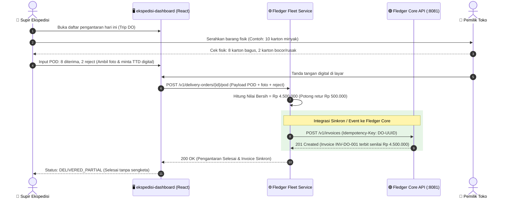

# FLEDGER FLEET — AI Agent Execution Brief & Technical Specification

> **Target Project**: **Fledger Fleet** (Logistics Dispatching, Delivery Order & Proof of Delivery Engine)  
> **Parent Ecosystem**: **FLEDGER OS** (*The Ledger-First Operating System for Distribution & Supply Chain*)  
> **Audience**: Autonomous AI Software Engineer / AI Coding Agent  
> **Role of this Document**: Comprehensive implementation blueprint, domain specification, database schema, integration contracts, and step-by-step execution playbook.

---

## 1. Executive Context & Mission for the AI Agent

### 1.1. Background & Mission
Distributor FMCG di Indonesia menghadapi masalah kritis di mana pergerakan fisik barang di atas truk logistik tidak sinkron dengan penerbitan faktur tagihan (*Invoice*) dan pembukuan resmi di kantor pusat (*HQ Financial Ledger*).

Sistem inti (**Fledger Core** di repo ini) telah selesai dibangun dan siap produksi sebagai *Core Financial Ledger & Settlement Engine* (double-entry, AR aging, hash chaining, RLS multi-tenancy). 

**Tugas Anda sebagai AI Agent berikutnya adalah membangun atau melengkapi service FLEDGER FLEET**:
1. Menghubungkan dashboard logistik (frontend React/Vite di `ekspedisi-dashboard`) dengan backend service armada.
2. Mengelola armada (*fleet*), penugasan supir (*driver dispatching*), dan penerbitan Surat Jalan (*Delivery Order / DO*).
3. Mengimplementasikan **Digital Proof of Delivery (POD)** via ponsel/tablet: foto barang bukti di lokasi, tanda tangan digital penerima toko, dan pencatatan partial delivery / retur barang rusak di tempat.
4. **Integrasi Otomatis ke Fledger Core**: Mengirimkan data penyelesaian kiriman ke Fledger Core API agar invoice resmi terbit seketika dengan nominal bersih (setelah dipotong retur), mencegah sengketa tagihan antara supir, toko, dan salesman.

---

## 2. Arsitektur Hubungan: Fledger Fleet ➔ Fledger Core



---

## 3. Spesifikasi Domain Model & State Machines

AI Agent wajib mengimplementasikan state machine yang deterministik untuk mencegah inkonsistensi status di lapangan:

### 3.1. Trip Dispatch State Machine
```
[DRAFT] ➔ (Tugaskan Supir & Truk) ➔ [DISPATCHED] ➔ (Supir Berangkat) ➔ [IN_TRANSIT] ➔ (Semua DO Selesai) ➔ [COMPLETED]
                                         │
                                         └── (Batal Jalan) ➔ [CANCELLED]
```

### 3.2. Delivery Order (DO / Surat Jalan) State Machine
```
[PENDING] ➔ (Muat ke Truk) ➔ [LOADED] ➔ (Dalam Pengiriman) ➔ [OUT_FOR_DELIVERY]
                                                                   │
       ┌───────────────────────────────────────────────────────────┼────────────────────────────────────────┐
       ▼                                                           ▼                                        ▼
[DELIVERED_FULL]                                           [DELIVERED_PARTIAL]                      [DELIVERY_FAILED]
(100% barang diterima baik)                             (Ada barang rusak/retur,                    (Toko tutup/pindah,
➔ Trigger Invoice Full                                   foto & bukti POD wajib)                     jadwalkan ulang)
                                                         ➔ Trigger Invoice Bersih
```

---

## 4. Skema Database PostgreSQL (DDL Migration)

AI Agent dapat langsung menggunakan atau mengadaptasi skema database PostgreSQL berikut untuk service Fledger Fleet:

```sql
-- 1. Tabel Kendaraan / Truk Armada
CREATE TABLE IF NOT EXISTS fleet_vehicles (
    id UUID PRIMARY KEY DEFAULT gen_random_uuid(),
    tenant_id UUID NOT NULL,
    plate_number VARCHAR(20) NOT NULL UNIQUE,
    vehicle_type VARCHAR(50) NOT NULL, -- 'CDE_BOX', 'CDD_BOX', 'BLIND_VAN', 'MOTOR_CARGO'
    capacity_kg NUMERIC(10, 2) NOT NULL DEFAULT 1000.00,
    status VARCHAR(20) NOT NULL DEFAULT 'AVAILABLE', -- 'AVAILABLE', 'ON_TRIP', 'MAINTENANCE'
    created_at TIMESTAMPTZ NOT NULL DEFAULT NOW(),
    updated_at TIMESTAMPTZ NOT NULL DEFAULT NOW()
);

-- 2. Tabel Supir Ekspedisi
CREATE TABLE IF NOT EXISTS fleet_drivers (
    id UUID PRIMARY KEY DEFAULT gen_random_uuid(),
    tenant_id UUID NOT NULL,
    full_name VARCHAR(100) NOT NULL,
    phone_number VARCHAR(30) NOT NULL,
    license_number VARCHAR(50) NOT NULL, -- SIM B1 / SIM A
    status VARCHAR(20) NOT NULL DEFAULT 'ACTIVE', -- 'ACTIVE', 'ON_DUTY', 'INACTIVE'
    created_at TIMESTAMPTZ NOT NULL DEFAULT NOW()
);

-- 3. Tabel Trip Pengiriman (Surat Tugas Jalan)
CREATE TABLE IF NOT EXISTS fleet_trips (
    id UUID PRIMARY KEY DEFAULT gen_random_uuid(),
    tenant_id UUID NOT NULL,
    trip_number VARCHAR(50) NOT NULL UNIQUE, -- e.g., 'TRIP-202610-001'
    vehicle_id UUID NOT NULL REFERENCES fleet_vehicles(id),
    driver_id UUID NOT NULL REFERENCES fleet_drivers(id),
    departure_time TIMESTAMPTZ,
    completed_time TIMESTAMPTZ,
    status VARCHAR(30) NOT NULL DEFAULT 'DRAFT',
    total_stops INT NOT NULL DEFAULT 0,
    created_at TIMESTAMPTZ NOT NULL DEFAULT NOW(),
    updated_at TIMESTAMPTZ NOT NULL DEFAULT NOW()
);

-- 4. Tabel Surat Jalan / Delivery Order (DO)
CREATE TABLE IF NOT EXISTS fleet_delivery_orders (
    id UUID PRIMARY KEY DEFAULT gen_random_uuid(),
    tenant_id UUID NOT NULL,
    trip_id UUID REFERENCES fleet_trips(id) ON DELETE SET NULL,
    do_number VARCHAR(50) NOT NULL UNIQUE, -- e.g., 'DO-202610-0089'
    customer_id UUID NOT NULL, -- ID Customer / Toko (terdaftar di Fledger Core)
    customer_name VARCHAR(150) NOT NULL,
    destination_address TEXT NOT NULL,
    destination_lat NUMERIC(10, 7),
    destination_lng NUMERIC(10, 7),
    total_items_ordered INT NOT NULL,
    total_items_delivered INT NOT NULL DEFAULT 0,
    total_items_rejected INT NOT NULL DEFAULT 0,
    nominal_ordered_cents BIGINT NOT NULL, -- Nilai total order sebelum retur
    nominal_delivered_cents BIGINT NOT NULL DEFAULT 0, -- Nilai bersih yang harus ditagih
    status VARCHAR(30) NOT NULL DEFAULT 'PENDING',
    fledger_invoice_id UUID, -- UUID invoice yang terbit di Fledger Core
    created_at TIMESTAMPTZ NOT NULL DEFAULT NOW(),
    updated_at TIMESTAMPTZ NOT NULL DEFAULT NOW()
);

-- 5. Tabel Item Detail Pengiriman
CREATE TABLE IF NOT EXISTS fleet_do_items (
    id UUID PRIMARY KEY DEFAULT gen_random_uuid(),
    do_id UUID NOT NULL REFERENCES fleet_delivery_orders(id) ON DELETE CASCADE,
    product_sku VARCHAR(50) NOT NULL,
    product_name VARCHAR(150) NOT NULL,
    qty_ordered INT NOT NULL,
    qty_delivered INT NOT NULL DEFAULT 0,
    qty_rejected INT NOT NULL DEFAULT 0,
    unit_price_cents BIGINT NOT NULL,
    rejection_reason VARCHAR(100), -- 'DAMAGED_LEAK', 'EXPIRED', 'WRONG_ITEM', 'REJECTED_BY_STORE'
    created_at TIMESTAMPTZ NOT NULL DEFAULT NOW()
);

-- 6. Tabel Proof of Delivery (POD)
CREATE TABLE IF NOT EXISTS fleet_proof_of_deliveries (
    id UUID PRIMARY KEY DEFAULT gen_random_uuid(),
    do_id UUID NOT NULL UNIQUE REFERENCES fleet_delivery_orders(id) ON DELETE CASCADE,
    recipient_name VARCHAR(100) NOT NULL,
    recipient_phone VARCHAR(30),
    signature_data_url TEXT NOT NULL, -- Base64 data URL signature canvas
    photo_evidence_urls TEXT[], -- Array URL foto barang & serah terima
    delivered_lat NUMERIC(10, 7) NOT NULL,
    delivered_lng NUMERIC(10, 7) NOT NULL,
    delivered_at TIMESTAMPTZ NOT NULL DEFAULT NOW(),
    driver_notes TEXT,
    created_at TIMESTAMPTZ NOT NULL DEFAULT NOW()
);
```

---

## 5. Kontrak Integrasi API dengan Fledger Core

AI Agent wajib memastikan bahwa ketika supir menyelesaikan pengantaran (POD tersimpan), Fledger Fleet memanggil Fledger Core API secara terproteksi:

### 5.1. Kredensial & Autentikasi
- **Fledger Core Base URL**: `http://localhost:8081` (Local Dev) atau `https://fledger-api.onrender.com` (Cloud).
- **Service Account / Login**:
  - Panggil `POST /v1/auth/login` dengan kredensial tenant admin (`demo-user` / `demo-password`) untuk mendapatkan Bearer JWT.
  - Setiap request keluar wajib menyertakan header:
    - `Authorization: Bearer <JWT_TOKEN>`
    - `X-Tenant-ID: 00000000-0000-0000-0000-000000000001`
    - `Idempotency-Key: <DO_UUID>` (mencegah double-invoicing jika request ter-retry).

### 5.2. Request Penerbitan Invoice Bersih ke Fledger Core
**Endpoint**: `POST /v1/invoices`  
**Request Body**:
```json
{
  "customer_id": "c1000000-0000-0000-0000-000000000001",
  "invoice_number": "INV-202610-DO-0089",
  "amount": 4500000,
  "currency": "IDR",
  "due_date": "2026-10-22T23:59:59Z",
  "notes": "Generated from DO-202610-0089 (8 Karton diterima, 2 Karton retur bocor di tempat. POD Recipient: Ibu Siti)"
}
```
**Expected Response (201 Created)**:
```json
{
  "id": "f1000000-0000-0000-0000-000000000099",
  "invoice_number": "INV-202610-DO-0089",
  "customer_id": "c1000000-0000-0000-0000-000000000001",
  "amount": 4500000,
  "status": "OPEN",
  "created_at": "2026-10-08T16:35:00Z"
}
```
Setelah response diterima, AI Agent wajib menyimpan `id` invoice tersebut ke kolom `fledger_invoice_id` di tabel `fleet_delivery_orders`.

---

## 6. Spesifikasi Endpoint REST API Fledger Fleet Service

AI Agent wajib mengimplementasikan API router berikut di backend Fledger Fleet:

| Method | Endpoint | Fungsi | Payload / Respon Kunci |
|---|---|---|---|
| `GET` | `/v1/fleet/vehicles` | List semua armada & status ketersediaan | Filter: `?status=AVAILABLE` |
| `POST` | `/v1/fleet/vehicles` | Registrasi armada baru | Plat nomor, tipe armada, kapasitas KG |
| `GET` | `/v1/fleet/drivers` | List supir | Nama, nomor HP, status kerja |
| `POST` | `/v1/fleet/trips` | Buat rute jalan baru (*Trip*) | `vehicle_id`, `driver_id`, daftar `do_ids` |
| `POST` | `/v1/fleet/trips/:id/dispatch` | Berangkatkan trip (status `IN_TRANSIT`) | Mengubah status semua DO menjadi `OUT_FOR_DELIVERY` |
| `GET` | `/v1/fleet/delivery-orders` | List Surat Jalan / DO | Filter: `?trip_id=...`, `?status=...` |
| `POST` | `/v1/fleet/delivery-orders` | Buat DO baru dari pesanan | Customer ID, alamat, daftar item SKU & harga |
| `POST` | `/v1/fleet/delivery-orders/:id/pod` | **Submit Digital POD & Selesaikan DO** | `recipient_name`, `signature_data_url`, `photo_urls`, `delivered_lat/lng`, `items` (qty delivered vs rejected). Otomatis trigger ke Fledger Core. |
| `GET` | `/v1/fleet/delivery-orders/:id/tracking` | Tracking publik untuk pemilik toko | Peta lokasi pengantaran, status DO, dan bukti tanda tangan POD |

---

## 7. Integrasi dengan Frontend `ekspedisi-dashboard`

Frontend ekspedisi yang saat ini berada di `c:\Dev\ekspedisi-dashboard` (berjalan di React/Vite) memiliki modul UI berikut yang perlu disambungkan oleh AI Agent:

1. **Dispatching Board (Tampilan Kantor Pusat Logistik)**:
   - Drag-and-drop alokasi Surat Jalan ke supir & truk.
   - Peta armada berbasis OpenStreetMap & Leaflet.
2. **Driver Mobile Web / View (Tampilan Supir di HP)**:
   - Kartu tugas pengantaran toko per toko sesuai urutan rute.
   - Tombol tombol aksi: "Tiba di Toko" ➔ "Input Cek Fisik" ➔ "Buka Kanvas TTD & Kamera".
3. **Komponen Tanda Tangan Digital (Canvas Signature)**:
   - Memanfaatkan library canvas HTML5 standar (`react-signature-canvas` atau vanilla `<canvas>`).
   - Menyimpan hasil tanda tangan dalam format Base64 PNG.
4. **Komponen Kamera / Upload Foto Kerusakan**:
   - Supir dapat mengambil foto barang bocor/rusak langsung dari kamera ponsel.

---

## 8. Panduan Langkah Demi Langkah untuk AI Agent (Agent Playbook)

AI Agent yang ditugaskan mengeksekusi project ini disarankan mengikuti fase berurutan berikut:

### 🎯 Fase 1: Setup Proyek & Skema Basis Data
1. Periksa struktur di repositori `ekspedisi-dashboard` atau buat sub-folder/service backend `fleet-api`.
2. Jalankan skrip migrasi DDL PostgreSQL pada Section 4 di atas.
3. Buat file seed sederhana berisi 3 kendaraan (CDE Box, Blind Van), 2 supir, dan 5 delivery order demo.

### 🎯 Fase 2: Implementasi REST Handlers & Domain Logic
1. Implementasikan CRUD kendaraan, supir, dan trip dispatching.
2. Implementasikan state machine validation:
   - DO tidak bisa di-POD jika status belum `OUT_FOR_DELIVERY`.
   - Trip tidak bisa di-complete jika masih ada DO berstatus `PENDING` atau `OUT_FOR_DELIVERY`.
3. Tulis unit tests untuk kalkulasi nominal bersih:
   $$\text{Nominal Bersih} = \sum (\text{Qty Delivered} \times \text{Unit Price})$$
   Pastikan jika ada 2 karton retur seharga Rp 250.000 dari total 10 karton (Rp 5.000.000), nominal bersih tepat Rp 4.500.000.

### 🎯 Fase 3: Integrasi Client Fledger Core
1. Buat adapter HTTP client `FledgerCoreClient`:
   - Metode `CreateInvoice(ctx, req)` dengan automatic retry pada HTTP 5xx.
   - Penanganan `Idempotency-Key` bernilai UUID unik per DO.
   - Logging terstruktur (`slog` atau Winston) mencatat status sinkronisasi invoice.
2. Tangani skenario kegagalan: jika Fledger Core sedang offline, simpan event ke *outbox queue* untuk di-retry secara berkala tanpa memblokir supir di lapangan.

### 🎯 Fase 4: Integrasi Tampilan Frontend & Digital POD
1. Hubungkan form POD di `ekspedisi-dashboard` ke endpoint `POST /v1/fleet/delivery-orders/:id/pod`.
2. Pastikan kanvas tanda tangan berfungsi responsif di layar sentuh mobile.
3. Tampilkan lencana status *"Synced to Fledger Core (INV-xxx)"* di samping status pengiriman yang telah selesai.

### 🎯 Fase 5: Pengujian Akhir & Verifikasi (Definition of Done)
1. Jalankan alur pengujian lengkap (E2E Smoke Test):
   - Buat Trip ➔ Berangkatkan Truk ➔ Submit POD Partial Delivery (8 diterima, 2 retur) ➔ Verifikasi invoice di Fledger Core bernilai tepat Rp 4.500.000 ➔ Verifikasi neraca Fledger Core tetap seimbang (*Balanced*).
2. Pastikan seluruh pengujian lulus dengan 0 kegagalan dan 0 lint warnings.

---

## 9. Aturan Keamanan & Batasan Teknis (Guardrails)

1. **Uang Selalu dalam Integer Minor Units**:
   - Semua nominal uang di database dan kalkulasi internal wajib menggunakan satuan minor integer/cents (misal: `BIGINT` dalam Rupiah penuh, tanpa koma desimal floating-point) untuk mencegah kesalahan pembulatan.
2. **Kesesuaian Zero-Cost Stack**:
   - Seluruh dependensi wajib kompatibel dengan database PostgreSQL gratisan (Neon.tech / Supabase) dan hosting gratis (Render / Koyeb / Vercel).
   - Jangan menggunakan Google Maps API berbayar; gunakan OpenStreetMap + Leaflet.js.
3. **Idempotency Guarantee**:
   - Mengklik tombol submit POD berulang kali di HP supir akibat sinyal jelek **tidak boleh** menciptakan 2 invoice kembar di Fledger Core.

---

> 📌 **Dokumentasi Pendukung Terkait**:
> - [Roadmap Microservices FLEDGER OS](roadmap-microservices.md)
> - [Panduan 9 Modul Fledger Core](../modules/README.md)
> - [Spesifikasi REST API Fledger Core](../api/overview.md)
