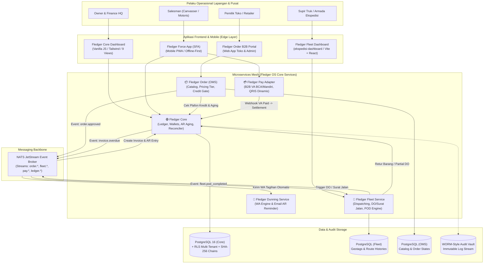
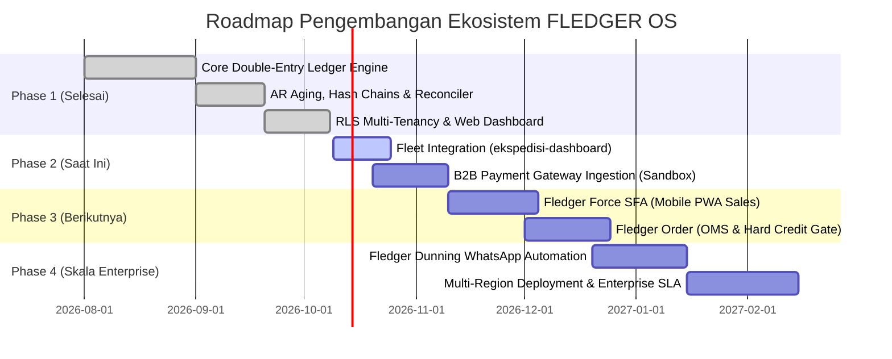

# FLEDGER OS — Enterprise Microservices Roadmap & Problem Mapping

> **Brand**: **FLEDGER OS** (*The Ledger-First Operating System for Distribution, Fleet Logistics & B2B Supply Chain*)  
> **Status**: Architectural Blueprint & Production Roadmap  
> **Reference Component**: Fledger Core Engine (Go 1.23, PostgreSQL 16, Redis, NATS JetStream)

---

## 1. Executive Summary & Filosofi Produk

Distribusi barang konsumsi (**Fast-Moving Consumer Goods / FMCG**) dan rantai pasok B2B di Indonesia merupakan industri bervolume tinggi dengan margin tipis yang beroperasi di wilayah geografis kepulauan yang sangat luas. Sebagian besar distributor konvensional masih mengandalkan pencatatan ERP tradisional (CRUD database pasif), nota kertas rangkap, penagihan tunai oleh salesman keliling (*canvasser*), dan supir ekspedisi logistik lepas.

Akibatnya timbul **gap informasi masif** antara fisik barang di jalan, uang kas di tangan salesman, dan pembukuan resmi di kantor pusat (HQ).

### Prinsip: Ledger-First Operating System
**FLEDGER OS** membalik paradigma tersebut. Fledger OS bukan sekadar ERP pencatat faktur, melainkan **Operating System Berbasis Buku Besar Finansial (Ledger-First Architecture)**:
1. **Financial Finality**: Setiap pergerakan barang (surat jalan, muatan truk, retur toko) dan setiap penerimaan uang (tunai, transfer, QRIS) wajib bermuara pada mutasi *double-entry ledger* yang berkekuatan hukum akuntansi dan anti-manipulasi (*cryptographically tamper-evident*).
2. **Real-time Observability**: Tidak ada toleransi untuk "menunggu akhir bulan" guna mengetahui posisi kas, piutang macet, atau kebocoran dana operasional.
3. **Zero Trust in Field Operations**: Setiap transaksi penagihan dan serah-terima barang memiliki jejak audit kriptografis, verifikasi digital dua arah dengan pemilik toko, dan proteksi limit kredit otomatis.

---

## 2. Peta Ekosistem Microservices (Bounded Contexts)

Dalam arsitektur target Fledger OS, sistem dipecah menjadi beberapa layanan mikro (*bounded contexts*) yang saling bekerja sama secara asinkron (*event-driven via NATS JetStream*) dan sinkron (*REST API dengan Idempotency-Key*).



### Rincian Peran Masing-Masing Service

| Microservice | Teknologi Utama | Tanggung Jawab Bisnis Kunci | Status Saat Ini |
|---|---|---|---|
| **Fledger Core** *(FMCG Wallet)* | Go 1.23, PostgreSQL 16, Redis | **The Single Source of Truth**. Double-entry ledger, Chart of Accounts, saldo wallet per entitas, AR aging calculation, period month-end locking, SHA-256 hash tamper detection, reconciler audit, multi-tenancy RLS. | **Production-Ready (Repo ini)** |
| **Fledger Fleet** | React, Vite, Node/Go, OpenStreetMap | **Logistik & Ekspedisi Pengiriman**. Mengelola armada truk/blindvan, rute pengantaran, Surat Jalan (Delivery Order), dan Proof of Delivery (POD) via foto & tanda tangan digital supir. | **Aktif Berjalan (`c:\Dev\ekspedisi-dashboard`)** |
| **Fledger Force (SFA)** | Mobile PWA (React / Flutter), SQLite | **Sales Force Automation**. Rute canvassing salesman harian (*beat plan*), geotagging toko, order taking lapangan, dan penerimaan kas tunai (*mobile cash collection*) dengan tanda terima digital instan. | **Roadmap Tahap 2** |
| **Fledger Pay** | Go / Node.js, Bank APIs | **B2B Payment Gateway Ingestion**. Integrasi Virtual Account perbankan nasional (BCA, Mandiri, BRI, BNI) dan QRIS Dinamis B2B tercetak per invoice. Auto-reconciliation webhook seketika tanpa input manual kasir. | **Roadmap Tahap 2** |
| **Fledger Order (OMS)** | Go / NestJS, PostgreSQL | **B2B Order Management**. Manajemen katalog produk distributor, harga tiering grosir, alokasi stok gudang, dan validasi *Hard Credit Limit* ke Fledger Core sebelum pesanan diproses. | **Roadmap Tahap 3** |
| **Fledger Dunning** | Go / Node.js, Baileys / WA Cloud API | **Otomasi Penagihan Piutang**. Pengiriman notifikasi WhatsApp & Email otomatis pada H-3, Hari H jatuh tempo, dan eskalasi penagihan H+3/H+7/H+14 beserta link pembayaran QRIS/VA. | **Roadmap Tahap 3** |

---

## 3. 5 Masalah Nyata Industri FMCG Indonesia & Solusi Fledger OS

Saat Fledger OS diluncurkan secara *live*, sistem ini secara langsung menuntaskan 5 penyakit kronis yang menggerus profitabilitas distributor di Indonesia:

---

### Masalah 1: Uang Tagihan Menginap di Kantong Sales (*Cash Kitting / Gali Lubang Tutup Lubang*)
* **Realitas di Lapangan**: Salesman berkeliling menagih toko pada hari Senin. Uang kas puluhan juta diterima dari toko A, namun tidak langsung disetorkan ke kasir gudang hari itu. Uang tersebut dipakai untuk keperluan pribadi, lalu baru ditutup hari Kamis menggunakan uang setoran dari toko B. Jika perputaran uang macet, salesman melarikan diri (*fraud* kas lapangan).
* **Solusi Fledger OS**:
  1. Saat toko membayar tunai ke salesman di aplikasi **Fledger Force**, sistem langsung mencatat mutasi di **Fledger Core**:
     $$\text{Debit: } \text{Account:Salesman-Wallet} \quad | \quad \text{Kredit: } \text{Account:Customer-AR}$$
  2. Piutang toko seketika berkurang di sistem pusat, dan beban pertanggungjawaban uang fisik **berpindah 100% menjadi saldo hutang pribadi salesman** kepada perusahaan.
  3. Sistem langsung mengirimkan WhatsApp notifikasi bukti bayar resmi ke nomor pemilik toko. Salesman tidak bisa lagi berdalih "toko belum bayar".
  4. Ketika tiba di kantor gudang sore hari, kasir memindai QR settlement di HP salesman untuk memindahkan saldo:
     $$\text{Debit: } \text{Account:HQ-Cash} \quad | \quad \text{Kredit: } \text{Account:Salesman-Wallet}$$
     Salesman tidak dapat mengambil pesanan baru hari berikutnya jika saldo wallet-nya masih memiliki dana kas yang belum disetor (*Daily Settlement Lock*).

---

### Masalah 2: Sengketa Nota & Fisik Barang Rusak (*Delivery Mismatch vs Invoice vs POD*)
* **Realitas di Lapangan**: Supir mengirim 10 karton minyak goreng. Di lokasi, 2 karton ditemukan bocor/rusak. Supir hanya menyerahkan 8 karton, lalu nota kertas dicoret pulpen secara manual. Dua minggu kemudian, salesman menagih nominal 10 karton sesuai cetakan invoice awal. Pemilik toko tersinggung karena merasa ditipu dan menolak membayar seluruh tagihan. Finance di HQ tidak tahu ada barang rusak karena nota kertas coretan supir hilang atau terselip di truk.
* **Solusi Fledger OS**:
  1. Supir menggunakan aplikasi **Fledger Fleet** (`ekspedisi-dashboard`) saat menyerahkan barang di toko.
  2. Jika ada barang rusak, supir memilih opsi *Partial Delivery*: 8 diterima, 2 ditolak (*reject on delivery*), wajib melampirkan foto barang rusak dan tanda tangan digital pemilik toko pada layar HP (**Proof of Delivery / POD**).
  3. Fledger Fleet menembakkan event `fleet.pod_completed` ke NATS.
  4. **Fledger Core** secara otomatis menerbitkan *Credit Note / Retur Entry* dan merevisi nilai sisa tagihan invoice detik itu juga.
  5. Ketika salesman atau sistem penagihan menghubungi toko, nominal tagihan yang tertera di sistem sudah bersih 8 karton, lengkap dengan lampiran foto bukti penolakan barang di aplikasi. Nol sengketa.

---

### Masalah 3: Toko Macet Tetap Dikirimi Barang (*Credit Limit Blindness*)
* **Realitas di Lapangan**: Tim sales lapangan dan tim gudang bekerja berdasarkan insentif volume omset. Mereka terus menerima pesanan dari toko yang sebenarnya sudah menunggak pembayaran faktur lebih dari 60 hari. Ketika audit tahunan dilakukan, distributor mendapati tumpukan piutang tak tertagih (*Bad Debt*) hingga ratusan juta rupiah yang membahayakan kelangsungan bisnis.
* **Solusi Fledger OS**:
  1. Sebelum pesanan B2B disetujui di **Fledger Order (OMS)**, sistem melakukan *Real-Time Pre-Flight Check* ke endpoint `/v1/invoices` dan `/v1/aging` milik **Fledger Core**.
  2. Algoritma mengevaluasi 2 kriteria ketat (*Hard Credit Gate*):
     - **Plafon Kredit**: $(\text{Total Piutang Berjalan} + \text{Nilai Order Baru}) \le \text{Credit Limit Toko}$.
     - **Toleransi Keterlambatan**: Toko **tidak boleh** memiliki tagihan terbuka yang masuk ke dalam *Aging Bucket* $>30$ hari (atau $>60$ hari sesuai kebijakan tenant).
  3. Jika salah satu aturan dilanggar, status pesanan otomatis terkunci menjadi **`CREDIT_BLOCKED`**. Surat jalan di Fledger Fleet tidak akan pernah terbit kecuali ada persetujuan darurat (*Override Authorization*) dari Direktur/Finance Manager dengan PIN/MFA khusus.

---

### Masalah 4: Finance HQ & Owner "Buta" Hingga Akhir Bulan (*Delayed Manual Reconciliation*)
* **Realitas di Lapangan**: Rekonsiliasi antara penjualan, fisik barang di gudang, dan uang masuk di rekening koran bank dikerjakan secara manual di Microsoft Excel pada akhir bulan. Staf finance lembur berminggu-minggu mencocokkan mutasi bank baris demi baris. Jika terjadi selisih kas atau manipulasi data di database lama, kecurangan baru terendus berbulan-bulan setelah uang hilang.
* **Solusi Fledger OS**:
  1. **Continuous Automated Reconciler**: Background worker Fledger Core memverifikasi neraca saldo secara berkala:
     $$\sum \text{Debit} - \sum \text{Kredit} = 0$$
  2. **SHA-256 Cryptographic Hash Chaining**: Setiap baris mutasi memiliki hash terhubung dengan mutasi sebelumnya. Jika oknum database administrator (DBA) mencoba mengubah nominal transaksi di tabel `entries`, reconciler mendeteksi status `TAMPERED` seketika.
  3. **Month-End Two-Step Approval**: Penutupan periode buku (`POST /v1/periods/close/request` lalu `POST /v1/periods/close/approve`) membekukan seluruh saldo akun (*snapshot* permanen). Tidak ada transaksi susulan yang dapat diselipkan ke bulan yang telah ditutup (*backdating impossible*).
  4. Executive Dashboard Fledger OS menyajikan angka Kas Riil, Piutang Berjalan, dan Aging Risk detik ini juga di hadapan Owner.

---

### Masalah 5: Risiko Keamanan & Beredarnya Uang Palsu dalam Penagihan Tunai
* **Realitas di Lapangan**: Salesman motoris membawa tas berisi uang tunai Rp 30–50 juta berkeliling di daerah sepi atau pasar tradisional. Sangat rentan terhadap pembegalan, kecelakaan, pemerasan preman lokal, hingga terselipnya uang palsu saat menerima gepokan uang dari retailer.
* **Solusi Fledger OS**:
  1. Setiap faktur yang dicetak atau ditampilkan di HP salesman dilengkapi dengan **QRIS Dinamis B2B** dan nomor **Virtual Account BCA/Mandiri/BRI** unik yang digenerate oleh **Fledger Pay**.
  2. Pemilik toko cukup membuka aplikasi mobile banking apapun (BCA Mobile, Livin', BRImo, GoPay, OVO, ShopeePay) dan memindai QRIS tersebut.
  3. Dana langsung masuk ke rekening penampungan resmi distributor di bank tanpa pernah disentuh tangan salesman.
  4. Webhook bank memicu mutasi instan di Fledger Core: invoice otomatis lunas, toko menerima notifikasi WA lunas, dan salesman tidak perlu menanggung risiko membawa uang fisik di jalan.

---

## 4. Kontrak Integrasi & Protokol Komunikasi Antar-Layanan

Seluruh komunikasi antar-microservice di Fledger OS distandarisasi untuk menjamin integritas data transaksi perbankan:

### 4.1. Header Standar & Idempotency
Setiap panggilan REST API yang memicu mutasi finansial wajib menyertakan:
- `Authorization: Bearer <JWT_TOKEN>` (berisi claims: `sub`, `tenant_id`, `role`, `jti`).
- `X-Tenant-ID: <UUID>` (untuk PostgreSQL Row-Level Security isolation).
- `Idempotency-Key: <UUID>` (disimpan di Redis/Postgres untuk mencegah eksekusi ganda jika terjadi network timeout/retry).
- `traceparent: 00-4bf92f3577b34da6a3ce929d0e0e4736-00f067aa0ba902b7-01` (W3C Distributed Tracing).

### 4.2. Topik Event NATS JetStream

| Event Topic | Publisher | Consumer | Payload Ringkas | Tindakan Lanjutan |
|---|---|---|---|---|
| `fledger.order.approved` | Fledger Order | Fledger Fleet | `{order_id, tenant_id, customer_id, items, total_amount}` | Terbitkan Surat Jalan & alokasikan supir pengiriman |
| `fledger.fleet.pod_completed` | Fledger Fleet | Fledger Core | `{do_id, order_id, delivered_qty, rejected_qty, photo_url, signature_url}` | Terbitkan Invoice resmi & Credit Note jika ada retur barang |
| `fledger.pay.va_settled` | Fledger Pay | Fledger Core | `{invoice_id, amount, bank, va_number, ref_id}` | Eksekusi double-entry transfer dari Customer AR ke Bank Account |
| `fledger.force.cash_received` | Fledger Force | Fledger Core | `{customer_id, sales_rep_id, amount, receipt_no}` | Pindahkan piutang toko ke Sales Rep Wallet |
| `fledger.core.invoice_overdue` | Fledger Core | Fledger Dunning | `{invoice_id, customer_phone, due_date, amount_due}` | Kirim pesan WhatsApp pengingat tagihan ke toko |

---

## 5. Strategi Deployment 100% Gratis untuk MVP Live Demo (Zero-Cost Stack)

Untuk memvalidasi produk di depan calon investor, mitra distributor, atau saat demonstrasi portfolio, seluruh ekosistem Fledger OS dapat dijalankan di cloud publik **tanpa mengeluarkan biaya server sedikitpun ($0 / Rp 0)** menggunakan kombinasi layanan free-tier berikut:

### 5.1. Matriks Infrastruktur Gratisan (Zero-Cost Matrix)

| Komponen Sistem | Platform Cloud Gratis | Batasan Free Tier | Alasan & Keunggulan |
|---|---|---|---|
| **Fledger Core API (Go Binary)** | **Render.com** atau **Koyeb** | 512 MB RAM, free web service, free SSL domain | Binary Go hanya berukuran ~20MB dan konsumsi RAM idle hanya ~25MB. Sangat ringan untuk free container. |
| **Fledger Core Web Dashboard** | **Vercel** / **Cloudflare Pages** | Unlimited bandwith harian, global CDN, instant deploy | File HTML/JS/CSS statis (zero npm dependencies) disajikan dengan kecepatan instan dari Edge CDN. |
| **Fledger Fleet (`ekspedisi-dashboard`)** | **Vercel** / **Netlify** | Gratis host project React/Vite | Langsung terintegrasi via git push GitHub repo ekspedisi. |
| **Database PostgreSQL 16** | **Neon.tech** atau **Supabase** | Neon: 0.5 GB storage, serverless autoscaling, branchable | Mendukung penuh ekstensi UUID, Row-Level Security (RLS), dan koneksi pooled string connection. |
| **Cache & Event Bus (Lite)** | **Upstash Redis** | 10,000 requests/hari gratis | Serverless Redis untuk rate-limiting token bucket dan idempotency lock tanpa kartu kredit. |
| **Peta & Geocoding Armada** | **OpenStreetMap + Leaflet.js** | 100% Gratis / Tanpa Biaya | Tidak memerlukan kartu kredit untuk billing Google Maps API. Tile peta gratis dan bebas watermark. |
| **Simulasi Virtual Account & QRIS** | **Midtrans / Xendit Sandbox** | Gratis tanpa batas waktu | Menyediakan simulator transfer bank (BCA/Mandiri VA simulator & QRIS tester) tanpa syarat legalitas PT/SIUP. |
| **Notifikasi WhatsApp Demo** | **Telegram Bot API** atau **Baileys WA Engine** | Gratis 100% | Bot Telegram resmi gratis tanpa biaya per template pesan, atau Baileys via scan QR WA untuk demo interaktif. |

### 5.2. Skenario Demo Interaktif (Zero-Dollar Pitch Demo Flow)

Berikut skenario presentasi langsung (live walkthrough) yang dapat ditunjukkan kepada klien atau audiens:

```
[1. Toko Buat Order]
Fledger Order Portal -> Buat order Rp 5.000.000 -> Sistem loloskan (Credit Limit toko Rp 10.000.000)
        │
        ▼
[2. Supir Kirim & Catat POD]
Fledger Fleet Dashboard -> Supir buka Surat Jalan -> Simulasikan barang tiba
(9 karton diterima, 1 karton bocor) -> Supir foto bukti bocor & minta tanda tangan toko
        │
        ▼
[3. Core Menerbitkan Invoice & Retur]
Fledger Core Dashboard -> Buka modul Invoices -> Terlihat otomatis tagihan tersisa Rp 4.500.000
(Nilai telah dipotong otomatis oleh Credit Note barang rusak dari Fleet)
        │
        ▼
[4. Pembayaran via Simulator Virtual Account]
Buka simulator Midtrans/Xendit Sandbox -> Salin nomor BCA Virtual Account faktur -> Klik "Pay"
        │
        ▼
[5. Real-Time Settlement di Core Ledger]
Dalam 2 detik:
- Status Invoice di Fledger Core berubah menjadi "PAID"
- Buka modul Transfers: Muncul mutasi Debit Bank BCA & Kredit AR Customer
- Buka modul Reconciler: Klik "Run Full Audit" -> Status: BALANCED, 0 Tampered
- Buka modul Audit: Tercatat webhook event dengan timestamp presisi & W3C trace ID
```

Semua alur di atas berjalan di cloud publik tanpa biaya operasional sepeser pun.

---

## 6. Roadmap Milestones & Tahapan Pengembangan



### Rincian Deliverables Tiap Fase:

1. **Phase 1: Financial Ledger Hardening (SELESAI - Sprint 1 s/d 22B)**:
   - ✅ Double-entry ledger invariant & transactional locking (`SELECT FOR UPDATE`).
   - ✅ AR Aging Schedule (4 buckets: 0-30, 31-60, 61-90, >90 hari).
   - ✅ Cryptographic hash chains (SHA-256) per mutasi baris.
   - ✅ Month-end closing dengan maker-checker approval.
   - ✅ Reconciler background worker & continuous trial balance audit.
   - ✅ Multi-tenancy Row-Level Security (PostgreSQL RLS) & zero-npm Web Dashboard 9 views.

2. **Phase 2: Fleet Integration & B2B Payment Adapter (Target Bulan Berjalan)**:
   - 🔄 Menghubungkan repo [`ekspedisi-dashboard`](file:///c:/Dev/ekspedisi-dashboard) dengan Fledger Core via REST webhook.
   - 🔄 Menerbitkan Surat Jalan (DO) otomatis dari database order.
   - 🔄 Menangkap Proof of Delivery (POD) digital (foto + tanda tangan canvas) dan menghasilkan otomatis *Credit Note* pemotongan faktur di Core.
   - 🔄 Mengintegrasikan Midtrans / Xendit Sandbox untuk penerbitan BCA Virtual Account dan QRIS Dinamis.

3. **Phase 3: Fledger Force (SFA) & Fledger Order (OMS)**:
   - 📅 PWA Mobile untuk salesman kanvas (offline-first sync dengan IndexedDB).
   - 📅 Fitur rute kunjungan toko (beat plan) dengan validasi radius GPS (geofencing).
   - 📅 Portofolio katalog produk B2B dengan penetapan harga grosir bertingkat.
   - 📅 Integrasi *Credit Hold*: blokir penerbitan DO otomatis jika toko memiliki tunggakan $>30$ hari di Fledger Core.

4. **Phase 4: WhatsApp Dunning Automation & Skalabilitas Enterprise**:
   - 📅 Bot notifikasi penagihan piutang via WhatsApp (H-3, hari H, dan eskalasi jatuh tempo).
   - 📅 Rekening koran digital otomatis dikirim ke pemilik toko setiap tanggal 1 awal bulan.
   - 📅 Sertifikasi audit keamanan SOC2 / ISO 27001 readiness untuk kesiapan adopsi B2B Enterprise tingkat nasional.

---

> 🔗 **Tautan Terkait**:
> - [Panduan 9 Modul Fledger Core](../modules/README.md)
> - [Arsitektur Tingkat Tinggi & C4 Model](overview.md)
> - [C4 Container & Component Diagrams](c4-diagrams.md)
> - [Kamus Domain & Terminologi FMCG](../domain/glossary.md)
> - [ADR - Architectural Decision Records](../adr/index.md)
