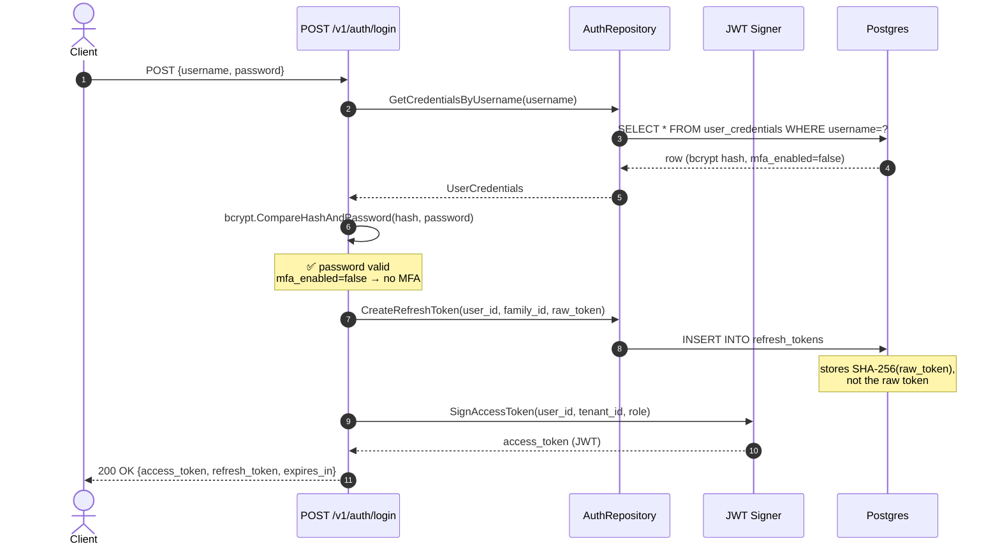
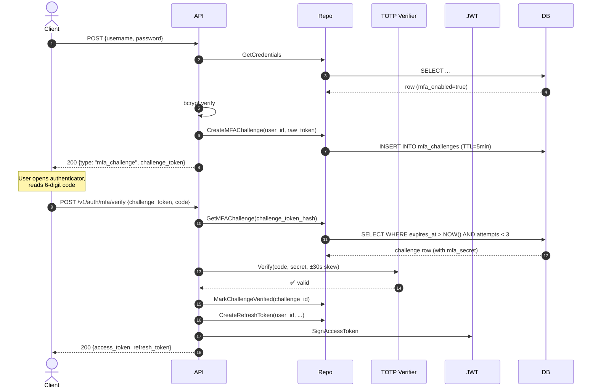
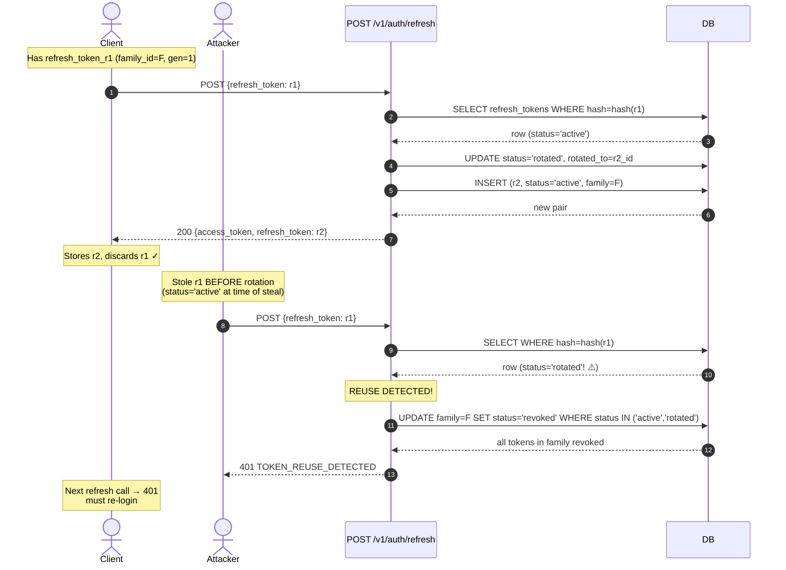
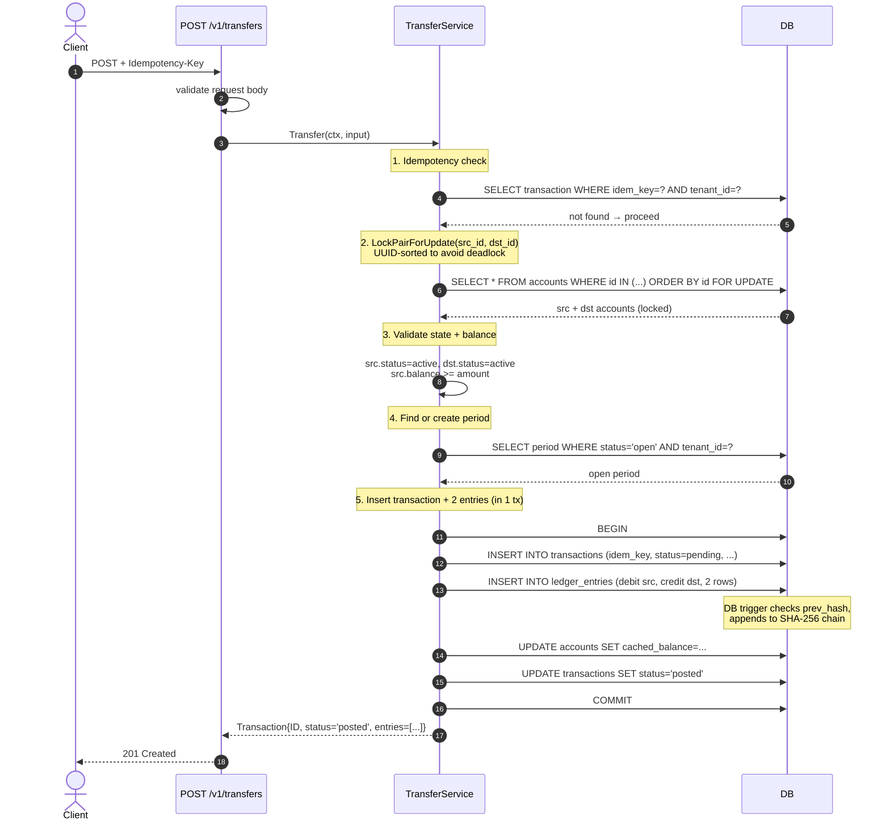
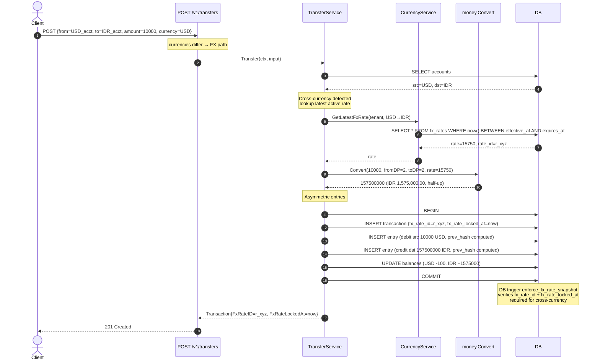
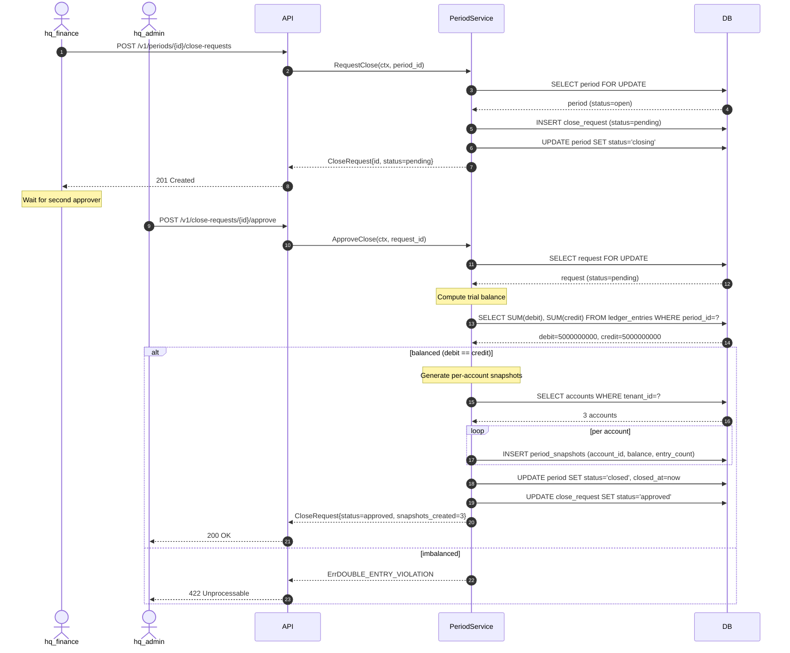
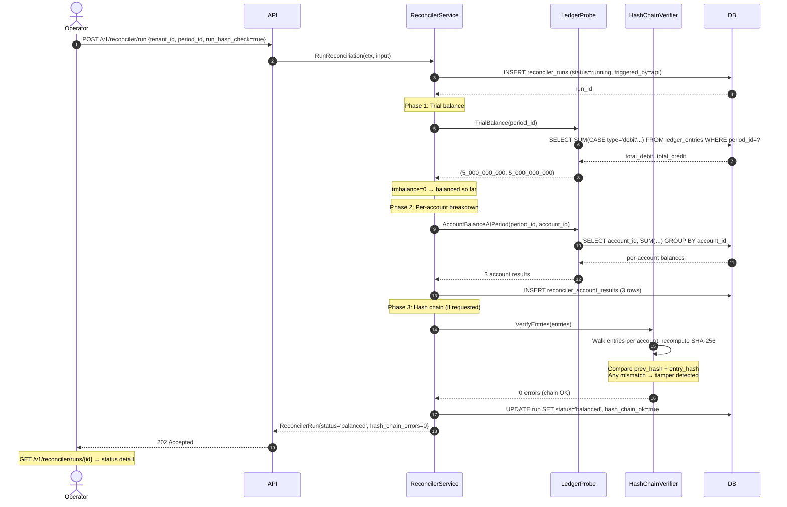
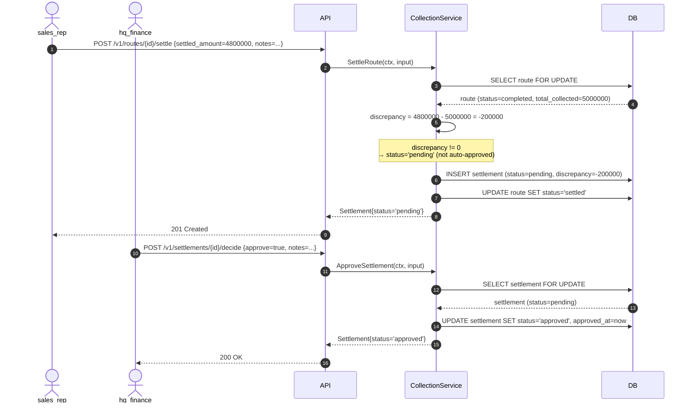
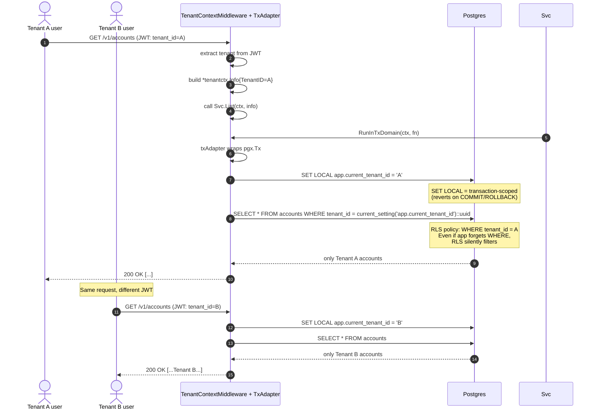

# Sequence Flows

Critical user journeys shown as Mermaid sequence diagrams. See [C4 Diagrams](c4-diagrams.md) for static architecture and [Architecture Overview](overview.md) for the narrative.

---

## 1. Login (no MFA)

**Key invariants:**
- Raw password never logged
- Bcrypt cost 10 (demo) / 12 (prod), ~25ms / ~250ms per hash
- Refresh token stored as SHA-256 hash only (not reversible)
- Access token stateless JWT (no DB lookup needed)

---

## 2. Login with MFA

**Key invariants:**
- 3 wrong attempts → 5 min lockout (DB enforced via trigger)
- Challenge token valid 5 min
- TOTP ±30s drift window (RFC 6238)

---

## 3. Refresh Token Rotation (with reuse detection)

**Critical security property:** Theft of a refresh token between legitimate rotations causes **whole-family revocation**. This protects against token theft even when attacker is faster than legitimate rotation.

---

## 4. Double-Entry Transfer (same currency)

**Concurrency guarantees:**
- `LockPairForUpdate` uses UUID-sorted order to prevent A↔B / B↔A deadlock
- Test: `TestConcurrent_NoDeadlocks_100x50` (100 goroutines × 50 iterations × 10 accounts)
- Idempotency-Key scoped per (tenant, endpoint), 24h TTL

---

## 5. Cross-Currency Transfer with FX Snapshot

**Audit-grade property:** `transactions.fx_rate_id + fx_rate_locked_at` are written once and immutable. Historical reports can replay the exact rate used, regardless of later rate changes.

---

## 6. Period Close (Two-Step Approval)

**Separation of duties:** The requester (hq_finance) and approver (hq_admin) MUST be different users. RBAC enforces this.

---

## 7. Reconciler Run (with hash chain check)

**Status precedence** (atomic in single tx):
1. Hash chain fails → `tampered` (highest)
2. Trial balance fails → `imbalanced`
3. All checks pass → `balanced`

---

## 8. Collection Route Settlement (with discrepancy approval)

**Invariant** (property-tested in Sprint 16):
- `discrepancy == settled_amount - expected_amount` (exact arithmetic, no float drift)
- Auto-approve only if `discrepancy == 0`

---

## 9. Multi-Tenant Isolation (Postgres RLS)

**Defense-in-depth:** RLS is enforced at DB level. Even if app code forgets to filter by `tenant_id`, the policy silently filters. Tested by `TestIntegration_RLSIsolation` (Sprint 17).

---

## Reference

- [C4 Diagrams](c4-diagrams.md) — static architecture views
- [Architecture Overview](overview.md) — narrative + module list
- [ADRs](../adr/index.md) — key decisions
