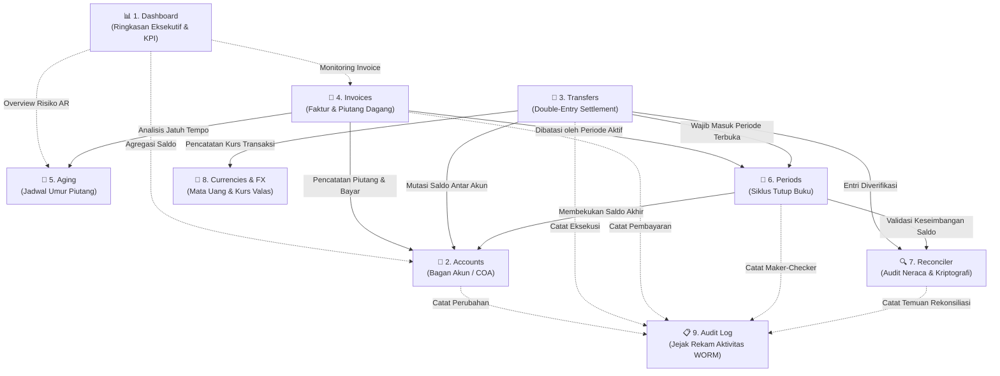

# Panduan & Dokumentasi Modul FMCG Wallet

Dokumentasi komprehensif ini menjelaskan fungsi bisnis, arsitektur teknis, antarmuka pengguna (UI), alur kerja operasional (*workflow*), dan relasi antar data untuk **9 modul utama** yang terdapat pada sistem **FMCG Wallet**.

---

## 🗺️ Peta Keterkaitan Antar Modul (Domain Relationship)

Semua modul dalam FMCG Wallet saling terhubung membentuk ekosistem tata kelola keuangan distributor yang terintegrasi dan *tamper-proof*:

---

## 1. 📊 Modul Dashboard (Executive Summary & Real-time KPI)

### A. Tujuan Bisnis
Menyediakan visibilitas keuangan *real-time* kepada manajemen puncak (*Executive / Finance Director*) dan supervisor operasional tanpa perlu menunggu laporan tutup buku di akhir bulan. Mengeliminasi masalah "buta kondisi keuangan" pada perusahaan distribusi FMCG.

### B. Komponen & Metrik Utama
1. **Ringkasan Kartu KPI (Stat Cards)**:
   - **Total Aset Kas (Total Assets)**: Agregasi saldo akun tipe `cash` dan `hq`.
   - **Total Piutang Dagang (Receivables)**: Total saldo berjalan pada akun tipe `receivable` dan `outlet`.
   - **Total Hutang Operasional (Payables)**: Total kewajiban pada akun tipe `payable`.
   - **Saldo Bersih (Net Position)**: Posisi likuiditas bersih (Aset − Kewajiban).
   - **Faktur Terbuka (Active Invoices)**: Jumlah faktur berstatus `open` atau `partial`.
   - **Total Outlet Terdaftar**: Jumlah akun pelanggan/toko aktif.
2. **Tabel Faktur Terbuka (Open Invoices)**: Menampilkan 5 invoice terakhir yang masih memiliki sisa tagihan beserta tanggal jatuh temponya.
3. **Ringkasan Umur Piutang (Aging Quick Overview)**: Memvisualisasikan risiko piutang toko pertama secara cepat per kategori hari.

### C. Backend Endpoints
- `GET /v1/accounts` (Mengambil data saldo akun riil)
- `GET /v1/invoices?status=open&limit=5` (Daftar invoice berjalan)
- `GET /v1/invoices/aging?customer_id=...` (Snapshot bucket penagihan)
- `GET /v1/periods` (Status periode akuntansi berjalan)

---

## 2. 🏦 Modul Accounts (Bagan Akun / Chart of Accounts)

### A. Tujuan Bisnis
Mengelola struktur sub-ledger rekening keuangan perusahaan. Di industri FMCG, arus kas tidak hanya berada di bank kantor pusat, melainkan tersebar di kasir depo, tas kas salesman lapangan (*canvassing*), dan piutang toko/retailer.

### B. Tipe-Tipe Akun (Account Types)
| Tipe Akun | Karakteristik Akun | Contoh Penggunaan Nyata |
|---|---|---|
| `cash` | Aset Lancar / Kas Operasional | Kasir Gudang, Brankas Depo, Rekening Bank BCA/Mandiri |
| `hq` | Rekening Kantor Pusat | Rekening Utama Treasury Pusat |
| `sales_rep` | Kas Titipan Sales Lapangan | Dompet saldo penagihan yang dibawa oleh Salesman |
| `customer` / `outlet` | Piutang Pelanggan / Toko | Sub-ledger tagihan Toko Kelontong, Supermarket, Grosir |
| `receivable` | Piutang Umum | Piutang dagang gabungan |
| `payable` | Kewajiban / Hutang Usaha | Hutang pengadaan barang ke prinsipal pabrik |
| `revenue` | Pendapatan Penjualan | Akun pengakuan omzet barang keluar |
| `suspense` | Rekening Penampung Sementara | Selisih transfer yang belum teridentifikasi |

### C. Alur Kerja (Workflow)
1. **Melihat Saldo**: Filter berdasarkan jenis akun (`cash`, `sales_rep`, `customer`) atau gunakan kotak pencarian kode/nama.
2. **Membuat Akun Baru**:
   - Klik tombol `+ New Account`.
   - Masukkan Kode Akun unik (misal: `OUT-WARUNG-01`, `SALES-BUDI-01`).
   - Tentukan nama lengkap, tipe akun, mata uang (`IDR`), dan saldo awal (*starting balance*).
   - Sistem secara otomatis mencatat pembukaan akun ke dalam ledger dan audit log.

### D. Backend Endpoints
- `GET /v1/accounts`
- `POST /v1/accounts`

---

## 3. 💸 Modul Transfers (Mutasi Dana & Double-Entry Ledger)

### A. Tujuan Bisnis
Mengeksekusi perpindahan dana internal, penyetoran hasil tagihan salesman ke kasir HQ (*settlement*), atau realokasi kas antar depo dengan jaminan **kebenaran akuntansi mutlak (*double-entry bookkeeping*)**.

### B. Aturan & Invarian Bisnis (Accounting Invariants)
1. **Double-Entry Invariant**: Setiap transfer selalu menghasilkan minimal sepasang entri jurnal: akun asal berkurang (Kredit), akun tujuan bertambah (Debit). Total selisih nominal **wajib Rp 0**.
2. **Deterministic Lock Ordering (`SELECT FOR UPDATE`)**: Mencegah kondisi *deadlock* saat banyak salesman melakukan transfer/setoran secara bersamaan dengan mengurutkan penguncian baris database berdasarkan UUID akun.
3. **SHA-256 Hash Chaining**: Setiap mutasi baru mengunci hash kriptografi dari mutasi sebelumnya (`prev_hash` ➔ `entry_hash`), menjamin data mutasi tidak dapat diedit langsung di database.
4. **Idempotency Protection**: Setiap transfer memiliki header `Idempotency-Key` (Stripe pattern) agar gangguan jaringan atau klik tombol berulang tidak menghasilkan mutasi ganda.

### C. Alur Kerja Pengguna
1. Pilih **Akun Asal (From Account)**, misal: Dompet Kas Sales Rep.
2. Pilih **Akun Tujuan (To Account)**, misal: Kas Utama HQ.
3. Masukkan **Jumlah Nominal (Rupiah)** dan Keterangan Transfer.
4. Klik `Create Transfer`. Saldo kedua akun langsung ter-update secara atomik.

### D. Backend Endpoints
- `POST /v1/transfers`
- `GET /v1/transfers/{id}`

---

## 4. 📄 Modul Invoices (Faktur Penjualan & Piutang Dagang)

### A. Tujuan Bisnis
Mengontrol siklus penagihan barang dagangan dari saat barang dikirim ke toko hingga dilunasi. Mencegah risiko gagal bayar dengan menerapkan pembatasan limit kredit pelanggan.

### B. Status Faktur (Invoice Lifecycle)
- **`open`**: Faktur baru terbit, belum ada pembayaran yang dialokasikan.
- **`partial`**: Toko telah membayar sebagian nominal tagihan; sisa tagihan masih berstatus piutang aktif.
- **`paid`**: Faktur telah lunas 100%.
- **`overdue`**: Faktur telah melewati tanggal jatuh tempo (`due_date`) dan belum lunas.

### C. Aturan Validasi Kredit (Credit Limit)
Sebelum faktur baru diterbitkan, sistem memvalidasi total piutang toko yang belum lunas ditambah nilai invoice baru tidak boleh melampaui `credit_limit` yang ditetapkan untuk toko tersebut.

### D. Alur Pembayaran Tagihan (Payment Allocation)
1. Buka modul Invoices.
2. Cari invoice yang berstatus `open` atau `partial`.
3. Klik tombol `Pay / Allocate`.
4. Masukkan nominal setoran dari toko.
5. Sistem memotong sisa tagihan invoice dan secara otomatis memindahkan saldo dari Piutang Toko ke Kasir/Sales Rep via entri jurnal.

### E. Backend Endpoints
- `GET /v1/invoices`
- `POST /v1/invoices`
- `POST /v1/invoices/{id}/payments`

---

## 5. 📅 Modul Aging (Jadwal Umur Piutang / AR Aging Schedule)

### A. Tujuan Bisnis
Alat mitigasi risiko kredit untuk tim Finance dan Supervisor Penagihan. Memberikan pengelompokan piutang berdasarkan lamanya keterlambatan pembayaran agar tindakan penagihan atau penahanan pengiriman (*credit hold*) dapat dilakukan tepat waktu.

### B. Pengelompokan Bucket Umur Piutang (Aging Buckets)
| Bucket | Rentang Keterlambatan | Arti Bisnis & Tindakan |
|---|---|---|
| **CURRENT** | 0 – 30 Hari | Tagihan lancar / baru terbit. Penagihan standar. |
| **DAYS_31_60** | 31 – 60 Hari | Lewat jatuh tempo ringan. Sales rep diingatkan untuk menagih. |
| **DAYS_61_90** | 61 – 90 Hari | Keterlambatan serius. Sistem merekomendasikan penahanan pesanan baru. |
| **OVER_90** | > 90 Hari | Piutang macet / risiko kerugian (*Bad Debt*). Eskalasi ke tim legal/manajemen. |

### C. Alur Kerja Pengguna
1. Pilih outlet/pelanggan pada dropdown **Pilih Customer**.
2. Sistem menampilkan ringkasan kartu total tagihan per bucket umur.
3. Tabel rincian menampilkan daftar invoice individual yang belum lunas beserta tanggal jatuh tempo dan jumlah hari keterlambatannya.

### D. Backend Endpoints
- `GET /v1/invoices/aging?customer_id={uuid}`

---

## 6. 📆 Modul Periods (Periode Akuntansi & Tutup Buku)

### A. Tujuan Bisnis
Mengendalikan siklus pelaporan keuangan berkala (bulanan). Mencegah manipulasi angka penjualan di masa lalu dengan cara mengunci periode akuntansi yang sudah lewat (*period freeze*).

### B. Alur Persetujuan Dua Tahap (Two-Step Maker-Checker Close)
Proses tutup buku dirancang dengan pemisahan tugas (*separation of duties*):
1. **Maker (Operator/Staff Finance)**:
   - Memeriksa kelengkapan transaksi bulan berjalan.
   - Mengajukan permohonan tutup buku dengan mengklik `Request close`. Status periode berubah dari `open` menjadi `closing`.
2. **Checker (Finance Manager / Admin HQ)**:
   - Meninjau laporan neraca dan hasil rekonsiliasi.
   - Memilih `Approve` untuk mengunci periode secara permanen (status `closed`), atau `Reject` jika masih ada selisih transaksi yang perlu diperbaiki.
3. **Period Snapshot**:
   - Saat status berubah menjadi `closed`, sistem mengambil *frozen snapshot* seluruh saldo akun pada detik tersebut. Saldo ini menjadi saldo awal periode berikutnya dan tidak dapat diubah lagi.

### C. Backend Endpoints
- `GET /v1/periods`
- `POST /v1/periods/{id}/close-requests`
- `POST /v1/periods/close-requests/{id}/approve`
- `POST /v1/periods/close-requests/{id}/reject`

---

## 7. 🔍 Modul Reconciler (Rekonsiliasi Buku Besar & Audit Kriptografi)

### A. Tujuan Bisnis
Memverifikasi kepatuhan neraca saldo dan membuktikan keutuhan data transaksi secara matematis tanpa campur tangan manusia.

### B. Komponen Form & Fitur Utama
1. **Pilihan Periode Akuntansi**:
   - Menampilkan tanggal ramah manusia: `🟢 01 Okt 2026 – 31 Okt 2026 (OPEN)`.
2. **Kotak Opsi Audit Kriptografi (SHA-256 Hash Chain)**:
   - **Rekonsiliasi Normal**: Memeriksa keseimbangan matematika: apakah `Total Debit == Total Kredit` (Imbalance = Rp 0).
   - **Deep Audit (Hash Chain Check)**: Memeriksa rantai kriptografi SHA-256 antar baris `ledger_entries` (`prev_hash` ➔ `entry_hash`). Membuktikan bahwa tidak ada baris transaksi yang diselipkan, diubah nominalnya, atau dihapus langsung di database oleh oknum (*tamper-proof check*).
3. **Indikator Status Hasil Rekonsiliasi**:
   - `✅ BALANCED`: Debit = Kredit seimbang (Imbalance = 0). Buku besar sehat.
   - `⚠️ IMBALANCED`: Terjadi selisih saldo Debit ≠ Kredit. Periode tidak boleh ditutup sebelum selisih diinvestigasi.
   - `🚨 TAMPERED`: Terdeteksi pelanggaran rantai hash kriptografi (data di database pernah dimanipulasi).

### C. Backend Endpoints
- `GET /v1/reconciler/runs`
- `POST /v1/reconciler/run`

---

## 8. 💱 Modul Currencies & FX (Master Mata Uang & Konversi Valas)

### A. Tujuan Bisnis
Menyediakan dukungan transaksi multi-mata uang bagi distributor FMCG yang mengimpor bahan baku dari luar negeri atau melayani transaksi dalam valuta asing, dengan mata uang dasar pelaporan tetap dalam Rupiah (`IDR`).

### B. Komponen Utama
1. **Mata Uang Terdaftar (Registered Currencies)**:
   - Menampilkan kode ISO (`IDR`, `USD`, `SGD`), nama resmi, presisi desimal, dan status aktif.
2. **Kalkulator Kurs Valas (FX Converter)**:
   - Pilihan mata uang asal (*From*) dan mata uang tujuan (*To*).
   - Tombol **Swap (`⇄`)** untuk membalik arah mata uang asal dan tujuan secara instan.
   - Kotak nominal dengan *currency addon badge* dinamis dan tombol cepat (*preset chips*: `+10`, `+50`, `+100`, `+1.000`).
   - Kartu hasil konversi menampilkan: nominal awal, hasil konversi, nilai kurs acuan aktif, waktu penetapan, serta `FX Rate ID` sebagai nomor referensi audit.

### C. Backend Endpoints
- `GET /v1/currencies`
- `POST /v1/currencies/convert`

---

## 9. 📋 Modul Audit (Audit Log Trail WORM-Style)

### A. Tujuan Bisnis
Memenuhi standar kepatuhan regulasi finansial (*financial regulatory compliance*) dan kebutuhan investigasi forensik jika terjadi sengketa atau anomali transaksi.

### B. Karakteristik WORM (Write Once, Read Many)
Setiap tindakan penting di sistem dicatat ke tabel `audit_logs` yang memiliki proteksi *immutability* di level PostgreSQL:
- **Tidak dapat diedit (`NO UPDATE`)**
- **Tidak dapat dihapus (`NO DELETE`)**
Bahkan akun setingkat Administrator tidak memiliki akses untuk menghapus jejak audit log.

### C. Data yang Direkam
- **Waktu Presisi**: Waktu terjadinya aksi transaksi.
- **Aktor**: UUID pengguna yang melakukan tindakan.
- **Aksi**: Tindakan spesifik (misal: `create_transfer`, `approve_period_close`, `allocate_payment`, `user_login`).
- **Tipe Sumber Daya (Resource)**: Objek yang dipengaruhi (`account`, `transaction`, `invoice`, `period`, `auth`).
- **Hasil (Outcome)**: `success` atau `failed`.
- **Identitas Jaringan**: IP Address (`host`) dan browser `User-Agent`.
- **Metadata Konteks**: Payload ID dan Request ID untuk penelusuran *distributed tracing*.

### D. Backend Endpoints
- `GET /v1/audit`
- `GET /v1/audit?resource_type={type}`

---

## 🔐 Matriks Hak Akses Peran (RBAC Matrix)

| Modul / Menu | HQ Admin (`hq_admin`) | Finance Admin (`finance_admin`) | Sales Rep (`sales_rep`) | Auditor (`auditor`) |
|---|:---:|:---:|:---:|:---:|
| **Dashboard** | Full Access | Full Access | Scoped View | Read-Only |
| **Accounts** | Create / View All | View All | View Own Account | Read-Only |
| **Transfers** | Create / View All | Create / View All | Create Scoped | Read-Only |
| **Invoices** | Create / Allocate | Create / Allocate | Allocate / View Own | Read-Only |
| **Aging** | View All Customers | View All Customers | View Assigned Outlets | Read-Only |
| **Periods** | Approve / Close | Request Close | No Access | Read-Only |
| **Reconciler** | Run / View All | Run / View All | No Access | Read-Only |
| **Currencies & FX** | View / Convert | View / Convert | View / Convert | Read-Only |
| **Audit Log** | View All | View All | No Access | Full Read-Only |
