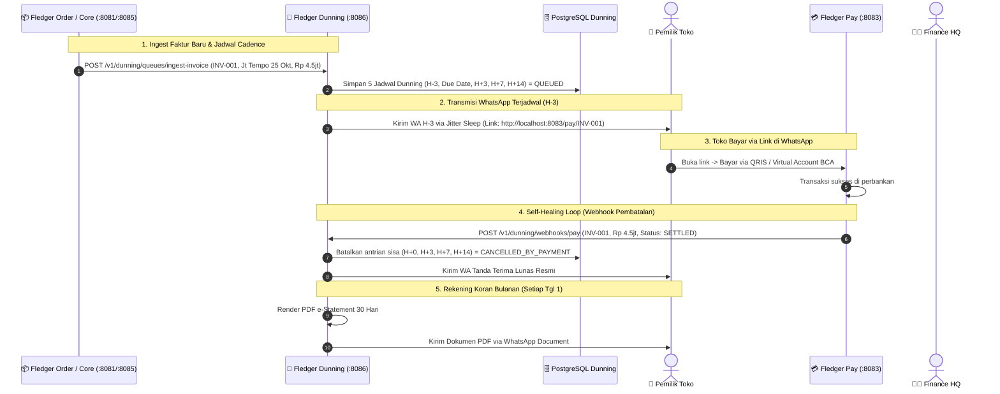

# FLEDGER DUNNING — AI Agent Execution Brief & Technical Blueprint

> **Parent Ecosystem**: **FLEDGER OS** (*The Ledger-First Operating System for Distribution & Supply Chain*)  
> **Service Name**: **Fledger Dunning** (`fledger-dunning`)  
> **Default Port**: `:8086`  
> **Target Audience**: Autonomous AI Coding Agent / Lead Software Engineer  
> **Goal**: Membangun dan mengoperasikan microservice **Fledger Dunning** sebagai engine *Automated Accounts Receivable (AR) Dunning*, *WhatsApp Notification Gateway*, *Anti-Ban Rate Limiter*, *Payment Deep-Link Generator*, dan *Monthly e-Statement PDF Dispatcher*.

---

## 1. Konteks Bisnis & Misi Utama untuk AI Agent

Dalam bisnis distribusi FMCG konvensional di Indonesia:
- **Penagihan Manual yang Bocor**: Staf piutang harus memeriksa mutasi manual lalu mengetik pesan WhatsApp satu per satu. Banyak faktur terlewat hingga menumpuk menjadi *bad debt*.
- **Kendala Pembayaran di Toko**: Saat ditagih via WA biasa, tidak ada tautan pembayaran cepat. Pemilik toko harus mencari buku tabungan, transfer manual di m-banking, dan mengirim foto struk ke staf finance.
- **Risiko Pemblokiran Akun WhatsApp**: Jika sistem mengirim pesan massal secara bersamaan (*blast*), nomor WhatsApp resmi perusahaan langsung diblokir permanen oleh sistem anti-spam Meta.

### Misi Anda (AI Agent)
Anda ditugaskan untuk membangun microservice **`fledger-dunning`** yang menyelesaikan seluruh masalah di atas:
1. **WhatsApp Dunning Cadence Otomatis (5 Tahap)**:
   - Menjadwalkan pengiriman pesan penagihan otomatis: H-3 (Pengingat ramah), Hari H (Jatuh tempo), H+3 (Pemberitahuan keterlambatan), H+7 (Peringatan tegas), dan H+14 (Pemberitahuan pemblokiran fasilitas kredit di **Fledger Order**).
2. **Dynamic 1-Click Payment Link Integration (`fledger-pay`)**:
   - Setiap pesan memuat tautan pembayaran unik ke [`fledger-pay`](file:///c:/Dev/fledger/fledger-pay) (QRIS & Virtual Account BCA/Mandiri/BRI).
3. **Self-Healing Loop (Pembatalan Otomatis saat Lunas)**:
   - Menerima webhook pelunasan dari `fledger-pay`. Seketika membatalkan seluruh jadwal dunning yang berstatus `QUEUED` untuk faktur tersebut, dan mengirim WhatsApp tanda terima lunas resmi ke toko.
4. **Anti-Ban Jitter Engine**:
   - Algoritma jeda acak (*random jitter sleep* 3–8 detik) dan variasi teks pesan (*spintax*) untuk melindungi nomor WhatsApp pengirim dari pemblokiran spam.
5. **Monthly PDF e-Statement Engine**:
   - Menghasilkan rekening koran digital bulanan format PDF standar perbankan dan mengirimkannya via WhatsApp Document API setiap tanggal 1 awal bulan.
6. **Embedded Web Management Portal (Zero-NPM)**:
   - Antarmuka web interaktif yang di-embed langsung ke binary Go (`embed.FS`) untuk monitoring antrian penagihan, pairing QR WhatsApp, dan simulator pesan interaktif.

---

## 2. Arsitektur Alur Transaksi Antar-Layanan



---

## 3. Struktur Standar Proyek (Clean Architecture)

AI Agent **wajib** mengikuti struktur direktori Clean Architecture berikut di dalam `fledger-dunning/`:

```
fledger-dunning/
├── cmd/
│   └── server/
│       └── main.go                   <-- Entrypoint HTTP server (:8086)
├── docs/                             <-- Dokumentasi teknis & spesifikasi
│   ├── AGENT-EXECUTION-BRIEF.md      <-- Dokumen ini
│   ├── DATABASE-SCHEMA.sql           <-- Skrip DDL PostgreSQL 16
│   ├── API-SPECIFICATION.md          <-- Kontrak REST API
│   ├── ROADMAP-DUNNING.md            <-- Rincian 5 Sprint & DoD
│   └── WHATSAPP-CADENCE-AND-STATEMENT-GUIDE.md <-- Panduan dunning & anti-ban
├── internal/
│   ├── config/                       <-- Penguraian variabel lingkungan (.env)
│   ├── domain/                       <-- Entitas inti & Interface repository
│   │   ├── config.go                 <-- Domain konfigurasi dunning
│   │   ├── contact.go                <-- Domain kontak toko
│   │   ├── queue.go                  <-- Domain antrian pesan dunning
│   │   ├── statement.go              <-- Domain rekening koran PDF
│   │   └── session.go                <-- Domain session WhatsApp
│   ├── repository/
│   │   └── postgres/                 <-- Query SQL mentah via pgxpool
│   ├── usecase/
│   │   ├── dunning_service.go        <-- Alur kerja cadence, ingest & cancel
│   │   ├── statement_service.go      <-- Pembuatan & dispatching PDF
│   │   └── whatsapp_service.go       <-- Pengiriman WA & anti-ban jitter
│   ├── delivery/
│   │   └── http/
│   │       ├── router.go             <-- Rute Chi (:8086) & middleware
│   │       ├── handler_whatsapp.go   <-- Handler session & status WA
│   │       ├── handler_queue.go      <-- Handler antrian dunning & cron
│   │       ├── handler_statement.go  <-- Handler e-statement PDF
│   │       └── handler_webhook.go    <-- Handler webhook Fledger Pay
│   └── platform/
│       ├── whatsapp/                 <-- Adaptor WhatsApp (Mock vs Live)
│       └── pdf/                      <-- Generator dokumen PDF
├── web/                              <-- Frontend Web Portal (HTML/CSS/JS)
│   ├── index.html                    <-- Portal dashboard dunning & pairing WA
│   ├── app.js                        <-- Logika JavaScript interaktif
│   └── style.css                     <-- Tema modern dark-mode glassmorphism
├── .env.example                      <-- Template variabel lingkungan
├── go.mod                            <-- Dependensi Go 1.23+
├── README.md                         <-- Panduan onboarding lokal
└── run-tests.ps1                     <-- Skrip verifikasi tes otomatis
```

---

## 4. Pedoman Teknis Kunci (Non-Negotiable Engineering Rules)

1. **Zero Floating Point Currency**:
   - Seluruh nilai moneter (`amount_due_minor`, `amount_paid_minor`, `closing_balance_minor`) **wajib bertipe `int64` / BIGINT**. Dilarang menggunakan `float32` atau `float64` untuk mencegah galat pembulatan desimal.
2. **Anti-Ban Jitter Delay**:
   - Setiap pengiriman pesan antrian via loop wajib menyertakan jeda acak:
     ```go
     delay := time.Duration(minJitter + rand.Intn(maxJitter-minJitter+1)) * time.Second
     time.Sleep(delay)
     ```
3. **Atomicity pada Webhook Pelunasan**:
   - Ketika webhook `payment.settled` diterima, pembatalan antrian dunning (`UPDATE dunning_queues SET status = 'CANCELLED_BY_PAYMENT' WHERE invoice_id = $1 AND status = 'QUEUED'`) wajib dieksekusi di dalam satu transaksi database PostgreSQL yang aman.
4. **Embedded Web Portal**:
   - Antarmuka web di dalam folder `web/` wajib disajikan langsung oleh Go binary menggunakan paket standar `embed.FS` tanpa memerlukan Node.js / NPM saat runtime:
     ```go
     //go:embed web/*
     var webFS embed.FS
     ```

---

## 5. Rencana Langkah Eksekusi untuk AI Agent

Saat memulai pengerjaan, lakukan tahapan berikut secara berurutan:
1. **Langkah 1**: Buat direktori dan jalankan `go mod init fledger-dunning`.
2. **Langkah 2**: Terapkan skema database dari [`DATABASE-SCHEMA.sql`](file:///c:/Dev/fledger/fledger-dunning/docs/DATABASE-SCHEMA.sql).
3. **Langkah 3**: Buat domain model dan implementasi repository PostgreSQL menggunakan `github.com/jackc/pgx/v5`.
4. **Langkah 4**: Implementasikan usecase:
   - Logika ingest faktur yang secara otomatis menghitung 5 tanggal eksekusi dunning (H-3, Hari H, H+3, H+7, H+14).
   - Logika pembatalan instan saat webhook pembayaran diterima.
   - Mock provider WhatsApp dengan logging pesan yang realistis.
5. **Langkah 5**: Bangun handler HTTP dan daftarkan ke router Go-Chi di port `:8086`.
6. **Langkah 6**: Buat embedded web portal di `web/` untuk memantau status antrian dan QR pairing.
7. **Langkah 7**: Tulis unit tests & integration test suite serta siapkan `run-tests.ps1` untuk memverifikasi 100% kelulusan tes.
