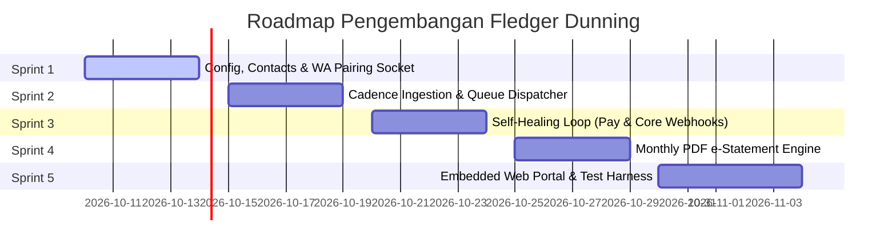

# FLEDGER DUNNING — Sprint Roadmap & Definition of Done

> **Ecosystem**: **FLEDGER OS**  
> **Service**: `fledger-dunning` (:8086)  
> **Target Release**: Phase 4 Milestone 1  

---

## 1. Timeline & Sprint Overview

---

## 2. Rincian Sprint & Kriteria Kesiapan (Definition of Done)

### 🏃 Sprint 1: Configuration, Store Contacts & WhatsApp Pairing Socket
* **Tujuan**: Membangun fondasi sistem konfigurasi tenant, master kontak toko, dan modul konektivitas WhatsApp (Mock simulator & Baileys socket).
* **Deliverables**:
  - DDL PostgreSQL tabel `dunning_configurations`, `dunning_store_contacts`, `dunning_whatsapp_sessions`.
  - CRUD REST API konfigurasi cadence hari `[-3, 0, 3, 7, 14]`.
  - Endpoint session WhatsApp (`/v1/dunning/whatsapp/status`, `/qr/generate`, `/test-send`).
  - Provider interface abtraksi (`MockProvider` untuk dev lokal dan `BaileysProvider` / `MetaCloudProvider`).
* **Definition of Done (DoD)**:
  - Unit test provider switching lulus 100%.
  - Endpoint QR code mampu mengembalikan string pairing base64 yang valid.

---

### 🏃 Sprint 2: Cadence Ingestion & Queue Dispatcher Engine
* **Tujuan**: Menerima data faktur dan secara otomatis menyusun 5 jadwal penagihan dengan perlindungan *anti-ban jitter delay*.
* **Deliverables**:
  - Endpoint `POST /v1/dunning/queues/ingest-invoice`.
  - Kalkulasi tanggal eksekusi otomatis sesuai `due_date` (H-3, Due Date, H+3, H+7, H+14).
  - Background dispatcher worker (`cron-run`) dengan jeda acak (*jitter* 3–8 detik).
  - Generator template teks pesan dinamis (*Spintax*).
* **Definition of Done (DoD)**:
  - 1 faktur yang di-ingest menghasilkan tepat 5 entri pada tabel `dunning_queues`.
  - Background worker memproses antrian tanpa ada pesan yang terkirim dalam interval $<3$ detik.

---

### 🏃 Sprint 3: Self-Healing Loop (Payment & Core Webhooks)
* **Tujuan**: Menghubungkan pelunasan faktur secara instan dengan pembatalan otomatis pesan dunning.
* **Deliverables**:
  - Endpoint `POST /v1/dunning/webhooks/pay` menerima sinyal dari `fledger-pay`.
  - Transaksi DB atomik: update status antrian `QUEUED` $\rightarrow$ `CANCELLED_BY_PAYMENT`.
  - Auto-dispatch pesan WhatsApp bukti terima pembayaran lunas ke pemilik toko.
  - Audit log pencatatan pembatalan.
* **Definition of Done (DoD)**:
  - Saat webhook bayar diterima, tidak ada lagi pesan dunning tahap berikutnya yang terkirim untuk faktur tersebut.
  - Response time webhook $<100$ms.

---

### 🏃 Sprint 4: Monthly PDF e-Statement Engine
* **Tujuan**: Otomasi penyusunan Rekening Koran Toko format PDF dan pengiriman dokumen via WhatsApp.
* **Deliverables**:
  - Service HTTP client penarik histori transaksi dari `fledger-core` (`/v1/invoices`, `/v1/transfers`).
  - PDF Generation Engine dengan layout elegan (header logo, rincian mutasi, saldo akhir, barcode/QRIS bayar).
  - Scheduler bulanan (setiap tanggal 1 pukul 06:00 WIB).
  - Modul transmisi file PDF via WhatsApp Document API.
* **Definition of Done (DoD)**:
  - File PDF berhasil di-generate secara deterministik tanpa merusak tata letak margin halaman.
  - File PDF terkirim dan tercatat pada tabel `dunning_statements`.

---

### 🏃 Sprint 5: Embedded Web Management Portal & Hardening
* **Tujuan**: Menyediakan Web UI kasir/finance modern (Zero-npm, embedded via `embed.FS`) dan skrip pengujian otomatis.
* **Deliverables**:
  - Web UI:
    - Status & QR Pairing WhatsApp real-time.
    - Antrian pesan aktif (Pending, Sent, Cancelled by Payment).
    - Simulator WhatsApp Chat (menampilkan preview tampilan chat di layar HP).
    - Tombol "Simulate Store Pays Invoice" untuk demonstrasi instan *Self-Healing Loop*.
  - Script test harness `run-tests.ps1` (Unit & Integration tests).
* **Definition of Done (DoD)**:
  - Single binary execution tanpa ketergantungan aset eksternal.
  - `run-tests.ps1` lulus 100% dengan zero failures.
