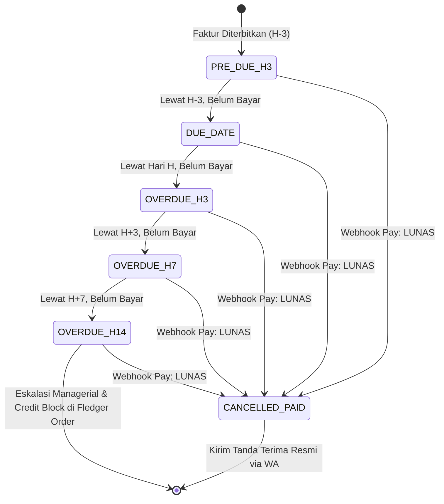

# FLEDGER DUNNING — WhatsApp Cadence, Anti-Ban & e-Statement Guide

> **Ecosystem**: **FLEDGER OS**  
> **Service**: `fledger-dunning` (:8086)  
> **Tujuan**: Menjamin penagihan piutang toko berjalan 100% otomatis, aman dari pemblokiran nomor WhatsApp Meta, dan menyajikan laporan rekening koran bulanan transparan.

---

## 1. Algoritma WhatsApp Dunning Cadence



### 1.1. Prinsip Jadwal Bertingkat (Cadence Table)

| Tahap | Timing | Tone of Voice | Aksi Dampak Sistem |
|---|---|---|---|
| `PRE_DUE_H3` | H - 3 Hari (09:00 WIB) | Ramah & Informatif | Mengirim rincian invoice & tombol bayar cepat |
| `DUE_DATE` | Hari H Jatuh Tempo (09:00 WIB) | Resmi & Menegaskan | Mengingatkan batas akhir pembayaran hari ini |
| `OVERDUE_H3` | H + 3 Hari (10:00 WIB) | Tegas Bersahabat | Meminta konfirmasi kendala dan penegasan kredit |
| `OVERDUE_H7` | H + 7 Hari (10:00 WIB) | Peringatan Keras | Notifikasi risiko penundaan alokasi armada truk |
| `OVERDUE_H14`| H + 14 Hari (08:30 WIB) | Penangguhan Fasilitas | Pemberitahuan bahwa status toko di **Fledger Order** telah dikunci (**`CREDIT_BLOCKED`**) |

---

## 2. Mekanisme Anti-Ban & Jitter Delay WhatsApp

WhatsApp / Meta memiliki algoritma deteksi otomatis terhadap nomor yang mengirim pesan serupa dalam frekuensi tinggi (bot spam). Untuk mencegah nomor operasional distributor diblokir, `fledger-dunning` menerapkan 4 lapis perlindungan:

### 2.1. Dynamic Jitter Delay
Pesan **tidak pernah** dikirim sekaligus dalam satu detik. Setiap pesan di antrian dieksekusi dengan jeda acak (*pseudo-random sleep*):
$$\text{Delay} = \text{Random}(\text{jitter\_min}, \text{jitter\_max}) \quad \text{detik (default: 3 hingga 8 detik)}$$

### 2.2. Spintax & Dynamic Message Variation
Pesan tidak memiliki teks identik secara biner. Sistem menyisipkan salam pembuka, waktu, nama toko, dan nomor referensi unik pada setiap kalimat:
- Pilihan Salam: `{Selamat pagi | Selamat siang | Yth. Bapak/Ibu | Salam hormat}`
- Sisipan Timestamp: `Pesan dibuat pada [Tanggal] [Jam] WIB`

### 2.3. Safe Daily Volume Throttling
Maksimal **200 pesan dunning per jam** per nomor WhatsApp yang terhubung. Jika antrian melebihi kapasitas jam tersebut, pesan otomatis dipecah ke gelombang jam berikutnya.

---

## 3. Integrasi Self-Healing Loop dengan Fledger Pay & Core

Kunci keunggulan Fledger OS adalah **tidak ada toko yang ditagih setelah mereka membayar**:

```
[1. Toko Membuka Link WA]
Pesan WA -> Klik "http://localhost:8083/pay/INV-001"
       │
       ▼
[2. Bayar di Fledger Pay]
Toko scan QRIS / bayar VA BCA -> Bank memvalidasi transaksi
       │
       ▼
[3. Webhook ke Dunning & Core]
Fledger Pay memancarkan webhook:
1. Ke Fledger Core: Catat Debit Kas Bank & Kredit Piutang (Status: PAID)
2. Ke Fledger Dunning: POST /v1/dunning/webhooks/pay
       │
       ▼
[4. Pembatalan Otomatis di Dunning]
Semua antrian (H+3, H+7, H+14) berstatus QUEUED seketika diubah menjadi CANCELLED_BY_PAYMENT.
       │
       ▼
[5. Pesan Terima Kasih Otomatis]
Dunning mengirimkan WhatsApp:
"Terima kasih Bapak/Ibu Toko Berkah. Pembayaran Faktur INV-001 senilai Rp 4.500.000 telah kami terima.
Fasilitas pemesanan Anda di Fledger Order tetap aktif normal."
```

---

## 4. Mesin Rekening Koran Bulanan (e-Statement Engine)

Setiap awal bulan (tanggal 1 pukul 06:00 WIB), `fledger-dunning` mengeksekusi proses pembuatan Rekening Koran:

### 4.1. Ekstraksi Data dari Fledger Core
Sistem mengambil data dari endpoint Fledger Core:
- Saldo awal piutang per 1 bulan lalu
- Seluruh faktur terbit selama bulan berjalan
- Seluruh retur barang (Credit Note dari Fledger Fleet)
- Seluruh mutasi pembayaran (Virtual Account & Tunai Kasir)
- Saldo akhir piutang (*closing balance*)

### 4.2. Render Dokumen PDF Standar Perbankan
Dokumen PDF dibuat memuat:
1. Header: Logo distributor, alamat, nomor izin usaha, dan periode buku.
2. Identitas Toko: Nama toko, kode pelanggan, alamat, dan nomor HP terdaftar.
3. Tabel Mutasi Kronologis: Tanggal, Keterangan, No Referensi, Debit (+Faktur), Kredit (-Bayar/-Retur), dan Saldo Berjalan.
4. Barcode / QRIS Pembayaran Sisa Saldo: Jika ada saldo akhir $>0$, QRIS terlampir langsung di bawah dokumen PDF.

### 4.3. Pengiriman WhatsApp Berkas PDF
Dokumen PDF dikirim langsung sebagai *Document Attachment* WhatsApp ke nomor pemilik toko.
