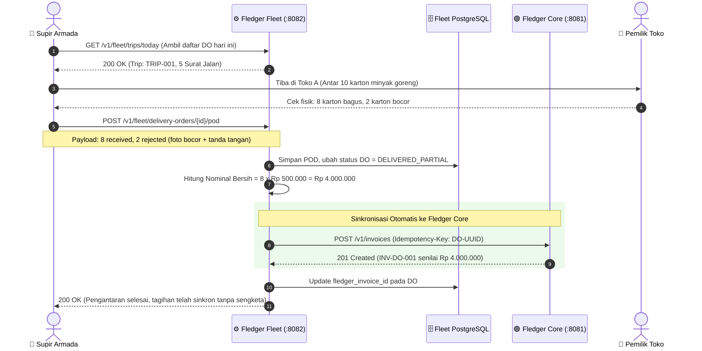

# FLEDGER FLEET — AI Agent Execution Brief & Technical Specification

> **Parent Ecosystem**: **FLEDGER OS** (*The Ledger-First Operating System for Distribution & Supply Chain*)  
> **Service Name**: **Fledger Fleet** (`fledger-fleet`)  
> **Target Audience**: Autonomous AI Coding Agent / Lead Software Engineer  
> **Goal**: Build and operationalize the Fleet Logistics, Dispatching, Delivery Order (DO), and Digital Proof of Delivery (POD) engine with direct settlement integration to Fledger Core.

---

## 1. Konteks Bisnis & Misi untuk AI Agent

### 1.1. Peran Fledger Fleet dalam Fledger OS
Dalam ekosistem distribusi FMCG dan logistik B2B di Indonesia, **fisik barang di jalan selalu mendahului uang dan faktur**:
1. Truk armada mengangkut barang dari gudang menuju puluhan toko/retailer setiap hari.
2. Sering terjadi masalah di lapangan: toko tutup, barang pecah/rusak di jalan, atau toko menolak sebagian barang (*partial rejection*).
3. Jika supir hanya mencoret nota kertas manual, kantor pusat (*HQ*) dan salesman tidak akan tahu hingga timbul sengketa saat penagihan.

**Tugas Utama Anda (AI Agent)**:
Membangun service **Fledger Fleet** yang bertindak sebagai:
- **Armada & Dispatch Manager**: Mengelola data kendaraan, supir, dan penugasan rute perjalanan (*Trip*).
- **Delivery Order Engine**: Menerbitkan Surat Jalan / DO resmi dengan rincian SKU, kuantitas, dan alamat tujuan.
- **Digital Proof of Delivery (POD)**: Menangkap bukti serah terima digital di tempat (tanda tangan touchscreen, foto bukti barang rusak, dan koordinat GPS).
- **Automated Settlement Bridge ke Fledger Core**: Begitu status DO selesai (`DELIVERED_FULL` atau `DELIVERED_PARTIAL`), service ini secara otomatis memanggil Fledger Core API (`POST /v1/invoices`) untuk menerbitkan faktur tagihan resmi dengan nominal bersih (setelah dipotong barang retur).

---

## 2. Arsitektur Komunikasi Antar-Layanan



---

## 3. State Machines & Status Operasional

### 3.1. Trip State Machine
```
[DRAFT] ➔ [DISPATCHED] ➔ [IN_TRANSIT] ➔ [COMPLETED]
   │
   └── [CANCELLED]
```
- **DRAFT**: Rute dan daftar DO sedang disusun oleh dispatcher gudang.
- **DISPATCHED**: Kendaraan dan supir telah ditugaskan, siap muat barang.
- **IN_TRANSIT**: Truk telah keluar gerbang gudang menuju rute pengantaran.
- **COMPLETED**: Seluruh DO dalam trip telah diselesaikan (lunas terantar atau gagal).

### 3.2. Delivery Order (DO) State Machine
```
[PENDING] ➔ [LOADED] ➔ [OUT_FOR_DELIVERY] ➔ [DELIVERED_FULL]
                                        ├── [DELIVERED_PARTIAL] (wajib ada bukti retur)
                                        └── [DELIVERY_FAILED]  (toko tutup/reschedule)
```

---

## 4. Skema Database PostgreSQL

Skrip DDL migrasi lengkap tersimpan di file:  
📁 [`docs/DATABASE-SCHEMA.sql`](DATABASE-SCHEMA.sql)

Tabel utama yang wajib diimplementasikan:
1. `fleet_vehicles`: Master data armada (plat nomor, jenis CDE/CDD/Blindvan, kapasitas KG, status).
2. `fleet_drivers`: Master data supir (nama, nomor HP, nomor SIM, status).
3. `fleet_trips`: Surat tugas perjalanan harian armada.
4. `fleet_delivery_orders`: Surat jalan per toko/outlet tujuan.
5. `fleet_do_items`: Rincian item SKU, jumlah dipesan, jumlah diterima, jumlah ditolak, dan alasan retur.
6. `fleet_proof_of_deliveries`: Bukti POD digital (tanda tangan digital Base64, foto bukti kerusakan, koordinat GPS, nama penerima).

---

## 5. Kontrak Integrasi API ke Fledger Core

Fledger Core berjalan di port `8081` (atau environment variable `FLEDGER_CORE_URL`).

### 5.1. Header Permintaan Wajib
```http
POST /v1/invoices HTTP/1.1
Host: localhost:8081
Authorization: Bearer <JWT_TOKEN>
X-Tenant-ID: 00000000-0000-0000-0000-000000000001
Idempotency-Key: <DO_UUID>
Content-Type: application/json
```

### 5.2. Payload Pembuatan Invoice
```json
{
  "customer_id": "c1000000-0000-0000-0000-000000000001",
  "invoice_number": "INV-202610-DO-0089",
  "amount": 4000000,
  "currency": "IDR",
  "due_date": "2026-10-22T23:59:59Z",
  "notes": "Generated from DO-202610-0089 (8 Karton diterima, 2 Karton retur bocor di tempat. Penerima: Ibu Siti)"
}
```

---

## 6. Rencana Eksekusi Bertahap (Sprint Playbook untuk AI Agent)

AI Agent disarankan mengeksekusi project ini mengikuti urutan berikut:

### 🚀 Sprint 1: Setup Proyek & Database
- Inisialisasi service (Go, Node/TypeScript, atau framework pilihan).
- Konfigurasi koneksi PostgreSQL dan jalankan migrasi dari [`DATABASE-SCHEMA.sql`](DATABASE-SCHEMA.sql).
- Buat data seeder: 2 kendaraan, 2 supir, 3 customer demo.

### 🚀 Sprint 2: CRUD Master Armada & Trip Dispatcher
- Implementasikan endpoint `/v1/fleet/vehicles`, `/v1/fleet/drivers`.
- Implementasikan pembuatan Trip `/v1/fleet/trips` dan dispatching `/v1/fleet/trips/:id/dispatch`.
- Tulis unit test untuk validasi kapasitas muatan truk vs total bobot DO.

### 🚀 Sprint 3: Delivery Order & Digital POD Engine
- Implementasikan endpoint `/v1/fleet/delivery-orders`.
- Implementasikan endpoint penyerahan POD: `POST /v1/fleet/delivery-orders/:id/pod`.
- Validasi input: Jika `qty_rejected > 0`, wajib menyertakan `rejection_reason` dan minimal 1 foto bukti kerusakan.

### 🚀 Sprint 4: Fledger Core HTTP Client & Auto-Invoicing
- Bangun adapter HTTP client dengan automatic retry (exponential backoff) untuk memanggil Fledger Core.
- Pastikan penggunaan `Idempotency-Key` menggunakan UUID Delivery Order agar pengiriman ulang tidak membuat invoice ganda.
- Simpan `fledger_invoice_id` pada tabel `fleet_delivery_orders`.

### 🚀 Sprint 5: Verification & End-to-End Testing
- Tulis E2E test: Mulai dari pembuatan Trip ➔ Pengantaran ➔ Submit POD Partial ➔ Verifikasi invoice di Fledger Core terbit dengan nilai yang benar.
- Pastikan linting dan test coverage mencapai standar produksi.

---

## 7. Guardrails & Aturan Teknis
1. **Nominal Finansial**: Semua nominal uang wajib disimpan sebagai integer minor units (`BIGINT` Rupiah) tanpa pecahan floating-point.
2. **Zero-Cost Compatible**: Jangan menggunakan API berbayar. Gunakan Leaflet/OpenStreetMap untuk pemetaan koordinat, dan PostgreSQL standar (Neon/Supabase/Local).
3. **Audit Trail**: Setiap perubahan status DO wajib mencatat timestamp dan user/driver ID yang melakukan perubahan.
