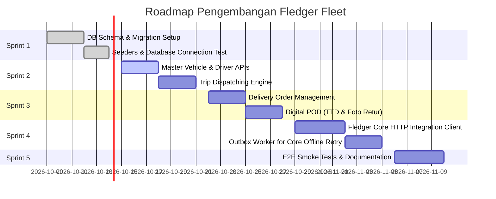

# FLEDGER FLEET — Sprint Roadmap & Definition of Done

> **Parent Ecosystem**: **FLEDGER OS**  
> **Service**: `fledger-fleet`  
> **Execution Mode**: Autonomous AI Agent / Developer Sprint

---

## 📅 Rincian Sprint Pengembangan

---

### Sprint 1: Pondasi Basis Data & Inisialisasi Service
- **Target**: Basis data PostgreSQL berjalan dengan seluruh tabel armada.
- **Deliverables**:
  - Script migrasi `migrations/` mengimplementasikan [`DATABASE-SCHEMA.sql`](DATABASE-SCHEMA.sql).
  - Config loader membaca `.env` (`PORT`, `DATABASE_URL`, `FLEDGER_CORE_URL`).
  - Unit test koneksi database & seed demo (2 armada, 2 supir, 3 DO).

### Sprint 2: Master Armada & Dispatching Perjalanan
- **Target**: Dispatcher gudang dapat mengatur truk, supir, dan rute perjalanan.
- **Deliverables**:
  - Endpoint CRUD `/v1/fleet/vehicles` dan `/v1/fleet/drivers`.
  - Endpoint `/v1/fleet/trips` dengan validasi: truk tidak boleh ditugaskan jika status masih `ON_TRIP`.
  - Endpoint `/v1/fleet/trips/:id/dispatch` mengubah status trip ➔ `IN_TRANSIT`.

### Sprint 3: Surat Jalan (DO) & Bukti Pengiriman Digital (POD)
- **Target**: Supir dapat menyelesaikan pengantaran dengan bukti digital.
- **Deliverables**:
  - Endpoint `/v1/fleet/delivery-orders`.
  - Endpoint `POST /v1/fleet/delivery-orders/:id/pod`:
    - Menangkap tanda tangan digital Base64.
    - Menangkap URL foto bukti jika ada barang rusak.
    - Menghitung otomatis nominal bersih: $(\text{Qty Delivered} \times \text{Harga})$.
    - Mengubah status DO menjadi `DELIVERED_FULL` atau `DELIVERED_PARTIAL`.

### Sprint 4: Integrasi Otomatis ke Fledger Core API
- **Target**: Setiap POD selesai otomatis memicu penerbitan invoice bersih di Fledger Core.
- **Deliverables**:
  - HTTP Client adapter yang memanggil `POST http://localhost:8081/v1/invoices`.
  - Header `Idempotency-Key` menggunakan UUID DO untuk mencegah faktur ganda.
  - Penyimpanan `fledger_invoice_id` pada record DO lokal.
  - Mekanisme Outbox table: jika Fledger Core sedang tidak dapat dijangkau, antrean pengiriman disimpan dan di-retry otomatis di latar belakang.

### Sprint 5: Verifikasi E2E & Dokumentasi
- **Target**: Sistem teruji bebas bug dan siap diintegrasikan dengan frontend.
- **Deliverables**:
  - Script pengujian otomatis `test_e2e_flow.sh` atau `.ps1`.
  - Skenario pengujian: 1 Trip dengan 2 DO (1 Full Delivery, 1 Partial Delivery karena 2 karton bocor).
  - Verifikasi neraca Fledger Core tetap seimbang (*Balanced*).

---

## ✅ Definition of Done (DoD)

Sebuah fitur atau sprint dinyatakan **SELESAI (DONE)** jika:
1. Kode berhasil dikompilasi tanpa error dan lolos linter (0 warnings).
2. Unit tests mencakup skenario sukses (*happy path*) dan skenario penolakan barang (*rejection path*).
3. Integritas data uang dijamin: tidak ada nilai minus dan tidak ada koma floating-point (seluruh nominal `BIGINT` minor cents).
4. Tidak ada hardcoded credentials (semua rahasia dan URL dibaca dari environment variables).
