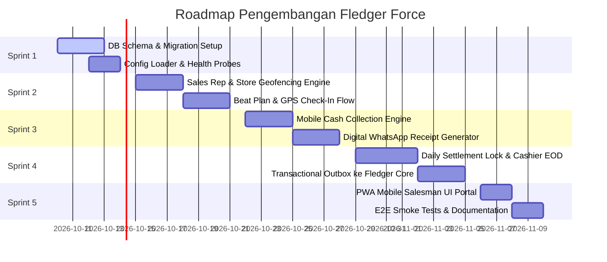

# FLEDGER FORCE — Sprint Roadmap & Definition of Done

> **Parent Ecosystem**: **FLEDGER OS**  
> **Service**: `fledger-force`  
> **Execution Mode**: Autonomous AI Agent / Lead Engineer Sprint

---

## 📅 Rincian 5 Sprint Pengembangan

---

### Sprint 1: Pondasi Basis Data, Migrasi & Health Probes
- **Target**: Basis data PostgreSQL berjalan dengan seluruh tabel SFA dan migrasi otomatis.
- **Deliverables**:
  - Script migrasi `migrations/000001_init_force.sql` mengimplementasikan [`DATABASE-SCHEMA.sql`](DATABASE-SCHEMA.sql).
  - Binary `cmd/migrator` dan `cmd/api` dengan graceful shutdown.
  - Config loader membaca `.env` (`PORT=8084`, `DATABASE_URL`, `FLEDGER_CORE_URL`).
  - Liveness probe `/healthz` dan Deep readiness probe `/readyz` (PostgreSQL ping).
  - Dev token auth helper `/v1/dev/login`.

---

### Sprint 2: Master Sales Rep, Katalog Toko & Geofencing GPS Check-In
- **Target**: Salesman dapat melihat rute kunjungan harian (*beat plan*) dan melakukan check-in GPS terverifikasi.
- **Deliverables**:
  - Endpoint master `/v1/force/sales-reps` dan `/v1/force/stores`.
  - Algoritma verifikasi jarak Haversine (menghitung meter selisih antara koordinat GPS HP salesman dan lokasi toko).
  - Endpoint `/v1/force/beat-plans/today` dan `/v1/force/visits/check-in`.
  - Pengecekan radius geofence: jika di luar 100 meter, status `geofence_verified: false` dan tercatat di audit log.

---

### Sprint 3: Engine Penerimaan Kas Lapangan & Bukti Bayar Digital (Anti-Cash Kitting)
- **Target**: Pembayaran kas di pasar langsung tercatat di sistem pusat dan memindahkan beban uang ke wallet salesman.
- **Deliverables**:
  - Endpoint `POST /v1/force/collections`.
  - Generator nomor kwitansi unik `RCP-YYYYMM-XXXXX`.
  - Penambahan saldo kas fisik di tangan (`force_sales_reps.current_cash_held`).
  - Proteksi batas plafon: jika kas melebihi `max_cash_limit` (Rp 50jt), tolak penerimaan kas baru sebelum melakukan setoran.
  - Enqueue mutasi outbox `force.cash_collected`:
    $$\text{Debit: Salesman-Wallet} \quad | \quad \text{Kredit: Customer-AR}$$
  - Format template payload notifikasi WhatsApp resmi ke pemilik toko.

---

### Sprint 4: Daily Settlement Lock & Cashier EOD Reconciliation
- **Target**: Kasir gudang memvalidasi setoran uang fisik sore hari dan membuka kunci order salesman.
- **Deliverables**:
  - Endpoint `/v1/force/settlements/reps/:id/inquiry` (menampilkan uang yang wajib disetor).
  - Endpoint `POST /v1/force/settlements` (kasir menghitung gepokan uang fisik dan menyelesaikan setoran).
  - Reset saldo kas salesman `current_cash_held = 0` dan pemulihan status salesman menjadi `ACTIVE`.
  - Enqueue mutasi outbox `force.eod_settled`:
    $$\text{Debit: HQ-Cash} \quad | \quad \text{Kredit: Salesman-Wallet}$$
  - Background worker `DrainLoop` memproses outbox ke Fledger Core dengan exponential backoff.

---

### Sprint 5: PWA Mobile Web Portal, Embedded Binary & Verifikasi E2E
- **Target**: Portal PWA mandiri untuk salesman di HP dan dashboard kasir di gudang.
- **Deliverables**:
  - Direktori `fledger-force/web/`:
    - Mode Salesman: Check-in rute toko, GPS mock/live button, dan form terima uang kas.
    - Mode Kasir: Meja setor EOD kasir dengan tombol instant settle.
  - Bundel static files langsung ke binary Go (`//go:embed all:files`).
  - Middleware CORS terbuka (`*`).
  - Script pengujian otomatis `scripts/run-tests.ps1` dan `scripts/e2e-flow.ps1` (100% test pass).

---

## ✅ Definition of Done (DoD)

Sebuah sprint dinyatakan **SELESAI (DONE)** jika:
1. Kode Go berhasil dikompilasi (`go build ./cmd/api`) tanpa warning dan lolos linter.
2. Seluruh unit tests lulus 100% (`go test -race ./...`).
3. **Integritas Uang**: Seluruh nominal kas menggunakan `int64` / `BIGINT`. Dilarang menggunakan tipe `float`.
4. **Idempotency**: Pemrosesan kwitansi dan outbox transfer memiliki idempotency key UUID unik untuk mencegah double transfer di Core.
5. **Zero Hardcoded Secrets**: Semua kredensial dimuat dari `.env`.
