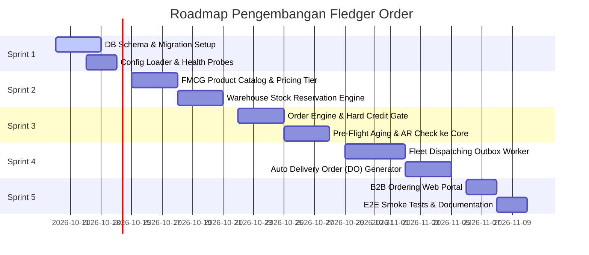

# FLEDGER ORDER — Sprint Roadmap & Definition of Done

> **Parent Ecosystem**: **FLEDGER OS**  
> **Service**: `fledger-order`  
> **Execution Mode**: Autonomous AI Agent / Lead Engineer Sprint

---

## 📅 Rincian 5 Sprint Pengembangan

---

### Sprint 1: Pondasi Basis Data, Migrasi & Health Probes
- **Target**: Basis data PostgreSQL berjalan dengan seluruh tabel pesanan dan migrasi otomatis.
- **Deliverables**:
  - Script migrasi `migrations/000001_init_order.sql` mengimplementasikan [`DATABASE-SCHEMA.sql`](DATABASE-SCHEMA.sql).
  - Binary `cmd/migrator` dan `cmd/api` dengan graceful shutdown.
  - Config loader membaca `.env` (`PORT=8085`, `DATABASE_URL`, `FLEDGER_CORE_URL`, `FLEDGER_FLEET_URL`).
  - Liveness probe `/healthz` dan Deep readiness probe `/readyz` (PostgreSQL ping).
  - Dev token auth helper `/v1/dev/login`.

---

### Sprint 2: Master Katalog SKU FMCG, Tiering Harga & Alokasi Stok Gudang
- **Target**: Distributor dapat mengelola katalog produk, harga grosir bertingkat, dan stok gudang.
- **Deliverables**:
  - Endpoint CRUD `/v1/order/products`.
  - Multi-tier pricing: penentuan harga berdasarkan tier toko (`GROSIR`, `SEMI_GROSIR`, `RETAIL`, `STAR_OUTLET`).
  - Mekanisme stok gudang: `on_hand_qty`, `reserved_qty`, dan penghitungan otomatis `available_qty`.
  - Proteksi stok: menolak pesanan jika `available_qty < requested_qty`.

---

### Sprint 3: Order Engine & Hard Credit Gate (Anti-Credit Limit Blindness)
- **Target**: Evaluasi otomatis kelayakan kredit toko sebelum pesanan disetujui.
- **Deliverables**:
  - Endpoint `POST /v1/order/orders` (membuat pesanan draft dan me-reserve stok fisik).
  - HTTP Client adapter ke Fledger Core:
    - Mengecek akumulasi piutang toko: $(\text{Piutang Berjalan} + \text{Order}) \le \text{Limit Toko}$.
    - Mengecek tabel aging Core: Tolak jika ada invoice jatuh tempo $>30$ hari.
  - Endpoint `POST /v1/order/orders/:id/evaluate-credit`:
    - Mengubah status ke `APPROVED` jika lolos, atau mengunci ke `CREDIT_BLOCKED` jika gagal.
  - Endpoint `POST /v1/order/orders/:id/override-credit` (otorisasi darurat manajerial).

---

### Sprint 4: Fleet Dispatching Bridge & Outbox Worker
- **Target**: Pesanan yang disetujui otomatis diterbitkan sebagai Surat Jalan (DO) di Fledger Fleet.
- **Deliverables**:
  - Transaksional outbox: Menyimpan event `order.dispatched_fleet` ke `order_outbox`.
  - Background worker `DrainLoop` dengan exponential backoff.
  - HTTP Client adapter yang memanggil Fledger Fleet (`:8082`):
    `POST /v1/fleet/delivery-orders` dengan payload lengkap (nama toko, alamat, SKU, kuantitas, total berat kg).
  - Penyimpanan `fledger_fleet_do_id` pada pesanan lokal.

---

### Sprint 5: B2B Order Portal Web UI, Embedded Binary & Verifikasi E2E
- **Target**: Portal web mandiri bagi toko/admin untuk membuat pesanan dan memantau status kredit.
- **Deliverables**:
  - Direktori `fledger-order/web/`:
    - Katalog produk visual, keranjang belanja B2B, dan status limit kredit.
    - Tombol "Evaluasi Hard Credit Gate" interaktif untuk demo.
  - Bundel static files langsung ke binary Go (`//go:embed all:files`).
  - Middleware CORS terbuka (`*`).
  - Script pengujian otomatis `scripts/run-tests.ps1` dan `scripts/e2e-flow.ps1` (100% test pass).

---

## ✅ Definition of Done (DoD)

Sebuah sprint dinyatakan **SELESAI (DONE)** jika:
1. Kode Go berhasil dikompilasi (`go build ./cmd/api`) tanpa warning dan lolos linter.
2. Seluruh unit tests lulus 100% (`go test -race ./...`).
3. **Integritas Uang**: Seluruh nominal menggunakan `int64` / `BIGINT`. Dilarang menggunakan tipe `float`.
4. **Idempotency**: Pemrosesan outbox dispatch ke Fleet memiliki idempotency key UUID unik untuk mencegah dobel DO.
5. **Zero Hardcoded Secrets**: Semua kredensial dimuat dari `.env`.
