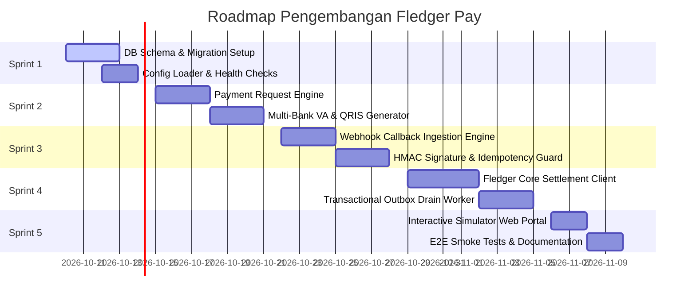

# FLEDGER PAY — Sprint Roadmap & Definition of Done

> **Parent Ecosystem**: **FLEDGER OS**  
> **Service**: `fledger-pay`  
> **Execution Mode**: Autonomous AI Agent / Lead Engineer Sprint

---

## 📅 Rincian 5 Sprint Pengembangan

---

### Sprint 1: Pondasi Basis Data, Konfigurasi & Health Probes
- **Target**: Basis data PostgreSQL berjalan dengan seluruh tabel pembayaran dan migrasi otomatis.
- **Deliverables**:
  - Script migrasi `migrations/` mengimplementasikan skrip [`DATABASE-SCHEMA.sql`](DATABASE-SCHEMA.sql).
  - Binary `cmd/migrator` dan `cmd/api` dengan graceful shutdown.
  - Config loader membaca `.env` (`PORT=8083`, `DATABASE_URL`, `FLEDGER_CORE_URL`, `WEBHOOK_SECRET`).
  - Liveness probe `/healthz` dan Deep readiness probe `/readyz` (PostgreSQL ping).
  - Dev token auth helper `/v1/dev/login`.

---

### Sprint 2: Engine Permintaan Pembayaran, Multi-Bank VA & QRIS Dinamis
- **Target**: Service dapat menerbitkan nomor Virtual Account unik (BCA, Mandiri, BRI) dan QRIS dinamis per invoice.
- **Deliverables**:
  - Modul generator nomor VA dengan prefix bank dan nomor HP/faktur unik.
  - Modul generator QRIS payload string standar EMVCo B2B.
  - Endpoint `POST /v1/pay/requests` (menerbitkan VA dan QRIS serentak).
  - Endpoint `GET /v1/pay/requests` dan `GET /v1/pay/requests/:id`.
  - Endpoint `POST /v1/pay/requests/:id/cancel`.

---

### Sprint 3: Webhook Ingestion, Validasi Signature & Proteksi Anti-Fraud
- **Target**: Menerima notifikasi pelunasan dari payment gateway atau simulator bank dengan proteksi anti-tamper.
- **Deliverables**:
  - Endpoint `POST /v1/pay/webhooks/:gateway` (Midtrans, Xendit, Direct Bank).
  - Validasi kriptografis HMAC SHA-256 / SHA-512 signature key.
  - **Idempotency Guard**: Menolak pemrosesan ganda jika bank mengirimkan webhook ganda (*duplicate callback rejection*).
  - Penyimpanan detail transaksi ke `pay_transactions`.
  - Transisi status `pay_payment_requests` dari `PENDING` ➔ `SETTLED`.

---

### Sprint 4: Integrasi Settlement ke Fledger Core & Outbox Worker
- **Target**: Pelunasan secara otomatis memicu pembukuan akuntansi double-entry di Fledger Core.
- **Deliverables**:
  - Transaksional Outbox: Insert event `fledger.pay.settled` ke `pay_settlement_outbox` dalam database transaction yang sama dengan transaksi pembayaran.
  - Background worker `DrainLoop` dengan interval polling berkala dan exponential backoff retry.
  - HTTP Client adapter yang memanggil Fledger Core:
    - Melakukan transfer pembukuan: Debit Kas Bank, Kredit Piutang Usaha (AR).
    - Menandai status invoice di Fledger Core sebagai `PAID`.
  - Endpoint `GET /v1/pay/outbox/counts`.

---

### Sprint 5: Web Simulator Portal & Verifikasi Pengujian E2E
- **Target**: Antarmuka web interaktif untuk demonstrasi simulasi pembayaran sandbox dan uji E2E bebas bug.
- **Deliverables**:
  - Direktori `fledger-pay/web/` berisi Portal Web Mandiri:
    - Menampilkan faktur terbuka & pilihan bank (BCA, Mandiri, QRIS).
    - Tombol "Bayar Sekarang (Sandbox Simulator)" untuk uji coba seketika.
    - Indikator real-time pelunasan dan sinkronisasi ke Core.
  - Static file server di `main.go` menyajikan web portal dari root `:8083`.
  - Middleware CORS terbuka (`*`).
  - Unit tests & E2E smoke tests script dengan 100% test pass.

---

## ✅ Definition of Done (DoD)

Sebuah sprint dinyatakan **SELESAI (DONE)** jika:
1. Kode Go berhasil dikompilasi (`go build ./cmd/api`) tanpa warning dan lolos linter.
2. Seluruh unit tests lulus 100% (`go test -race ./...`).
3. **Integritas Uang**: Tidak ada tipe data float untuk uang. Semua nominal menggunakan `int64` / `BIGINT`.
4. **Idempotency**: Pengiriman ulang webhook dengan reference yang sama tidak memicu double settlement.
5. **Zero Secret Hardcoding**: Semua kunci HMAC, JWT secret, dan kredensial dimuat melalui environment variables.
